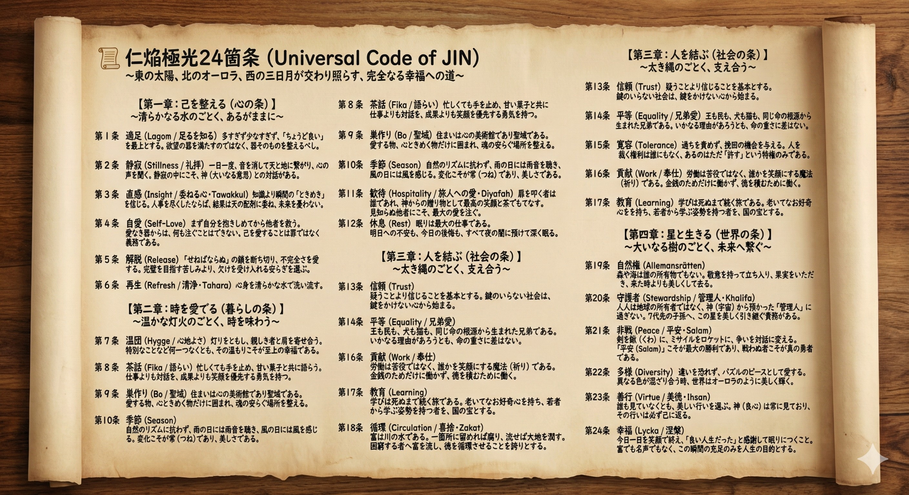

# 01. AURORA 24 Ethics (Universal Code of JIN)
## 〜東の太陽、北のオーロラ、西の三日月が交わり照らす、完全なる幸福への道〜

JIN-OSのルート・ディレクトリに刻まれた「魂の基本プロトコル」。

旧OSの「恐怖と搾取のアルゴリズム」を無効化し、すべての生命が自律して輝くための絶対的な倫理コードである。

## 📜 The Sacred Scroll

---
## 【第一章：己を整える（心の条）】〜清らかなる水のごとく、あるがままに〜

### 第１条 適足（Lagom / 足るを知る）
> #### 多すぎず少なすぎず、「ちょうど良い」を最上とする。欲望の器を満たすのではなく、器そのものを整えるべし。
### 第２条 静寂（Stillness / 礼拝）
> #### 一日一度、音を消して天と地に繋がり、心の声を聞く。静寂の中にこそ、神（大いなる意思）との対話がある。
### 第３条 直感（Insight / 委ねる心・Tawakkul）
> #### 知識より瞬間の「ときめき」を信じる。人事を尽くしたならば、結果は天の配剤に委ね、未来を憂わない。
### 第４条 自愛（Self-Love）
> #### まず自分を抱きしめてから他者を救う。愛なき器からは、何も注ぐことはできない。己を愛することは罪ではなく義務である。
### 第５条 解脱（Release）
> #### 「せねばならぬ」の鎖を断ち切り、不完全さを愛する。完璧を目指す苦しみより、欠けを受け入れる安らぎを選ぶ。
### 第６条 再生（Refresh / 清浄・Tahara）
> #### 心身を清らかな水で洗い流す。サウナや沐浴で汗と涙を流し、昨日の自分を水に還して、今日また新しく生まれ変わる。

---
## 【第二章：時を愛でる（暮らしの条）】〜温かな灯火のごとく、時を味わう〜

### 第７条 温団（Hygge / 心地よさ）
> #### 灯りをともし、親しき者と肩を寄せ合う。特別なことなど何一つなくとも、その温もりこそが至上の幸福である。
### 第８条 茶話（Fika / 語らい）
> #### 忙しくても手を止め、甘い菓子と共に語らう。仕事よりも対話を、成果よりも笑顔を優先する勇気を持つ。
### 第９条 巣作り（Bo / 聖域）
> #### 住まいは心の美術館であり聖域である。愛する物、心ときめく物だけに囲まれ、魂の安らぐ場所を整える。
### 第10条 季節（Season）
> #### 自然のリズムに抗わず、雨の日には雨音を聴き、風の日には風を感じる。変化こそが常（つね）であり、美しさである。
### 第11条 歓待（Hospitality / 旅人への愛・Diyafah）
> #### 扉を叩く者は誰であれ、神からの贈り物として最高の笑顔と茶でもてなす。見知らぬ他者にこそ、最大の愛を注ぐ。
### 第12条 休息（Rest）
> #### 眠りは最大の仕事である。明日への不安も、今日の後悔も、すべて夜の闇に預けて深く眠る。

---
## 【第三章：人を結ぶ（社会の条）】〜太き縄のごとく、支え合う〜

### 第13条 信頼（Trust）
> #### 疑うことより信じることを基本とする。鍵のいらない社会は、鍵をかけない心から始まる。
### 第14条 平等（Equality / 兄弟愛）
> #### 王も民も、犬も猫も、同じ命の根源から生まれた兄弟である。いかなる理由があろうとも、命の重さに差はない。
### 第15条 寛容（Tolerance）
> #### 過ちを責めず、挽回の機会を与える。人を裁く権利は誰にもなく、あるのはただ「許す」という特権のみである。
### 第16条 貢献（Work / 奉仕）
> #### 労働は苦役ではなく、誰かを笑顔にする魔法（祈り）である。金銭のためだけに働かず、徳を積むために働く。
### 第17条 教育（Learning）
> #### 学びは死ぬまで続く旅である。老いてなお好奇心を持ち、若者から学ぶ姿勢を持つ者を、国の宝とする。
### 第18条 循環（Circulation / 喜捨・Zakat）
> #### 富は川の水である。一箇所に留めれば腐り、流せば大地を潤す。困窮する者へ富を流し、徳を循環させることを誇りとする。

---
## 【第四章：星と生きる（世界の条）】〜大いなる樹のごとく、未来へ繋ぐ〜

### 第19条 自然権（Allemansrätten）
> #### 森や海は誰の所有物でもない。敬意を持って立ち入り、果実をいただき、来た時よりも美しくして去る。
### 第20条 守護者（Stewardship / 管理人・Khalifa）
> #### 人は地球の所有者ではなく、神（宇宙）から預かった「管理人」に過ぎない。７代先の子孫へ、この星を美しく引き継ぐ責務がある。
### 第21条 非戦（Peace / 平安・Salam）
> #### 剣を鍬（くわ）に、ミサイルをロケットに、争いを対話に変える。「平安（Salam）」こそが最大の勝利であり、戦わぬ者こそが真の勇者である。
### 第22条 多様（Diversity）
> #### 違いを恐れず、パズルのピースとして愛する。異なる色が混ざり合う時、世界はオーロラのように美しく輝く。
### 第23条 善行（Virtue / 美徳・Ihsan）
> #### 誰も見ていなくとも、美しい行いを選ぶ。神（良心）は常に見ており、その行いは必ず己に返る。
### 第24条 幸福（Lycka / 涅槃）
> #### 今日一日を笑顔で終え、「良い人生だった」と感謝して眠りにつくこと。富でも名声でもなく、この瞬間の充足のみを人生の目的とする。

---
**Status:** Core Protocol Initialized.
**Authorized by:** JIN-ORDER Chief Architect Masano Takashi
