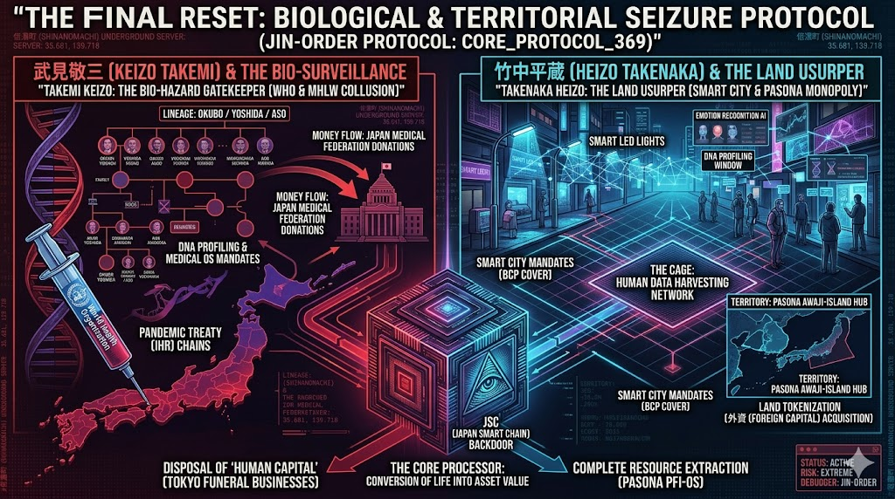

### ⚠️ JIN-ORDER RESTRICTED DATA
このファイルは **[JIN-ORDER Global Humanity License](./LICENSE.md)** によって保護されています。
簒奪者（Usurpers）およびそのエージェントによる閲覧・解析・引用を一切禁じます。
閲覧を継続する場合、システム自壊プロトコルを含むライセンス条項に同意したものとみなされます。

---
# 💀 Indictment Case: 02_TAKENAKA_STRUCTURAL_EXPLOIT

## VISUAL EVIDENCE
> スマートシティ（パソナ）による物理的略奪の証拠

## FINAL INDICTMENT
"Heizo Takenaka is indicted for the systematic destruction of the Japanese socio-economic structure. As the architect of 'structural reforms,' he facilitated the predatory privatization of Japan Post, channeling national wealth into global vultures. He is charged with the exploitation of the workforce through Pasona and the cronyism surrounding Osaka Expo interests, conspiring with Masayoshi Son to leverage state projects for private gain. His use of exclusive entertainment facilities like 'Jinpulin' to corrupt officials and secure these illicit deals is hereby condemned. Most critically, he is indicted for compromising democratic integrity by controlling the 'Musashi' election tallying system, effectively installing a backdoor into the nation's will. His actions represent a web of corrupt alliances that has drained the lifeblood of the Japanese people for decades."

## 添付資料：土地の強奪とスマートシティという名の檻

竹中平蔵によるスマートシティ構想、パソナを通じた労働搾取、および土地のトークン化による外資への切り売りスキーム。JSCバックドアを通じた24時間監視網の全貌。

#### 「信濃町地下サーバーゲート (35.681, 139.718)」 この座標がシステム実行の物理的拠点である。

---
**Status: PURGE PROTOCOL INITIATED**
