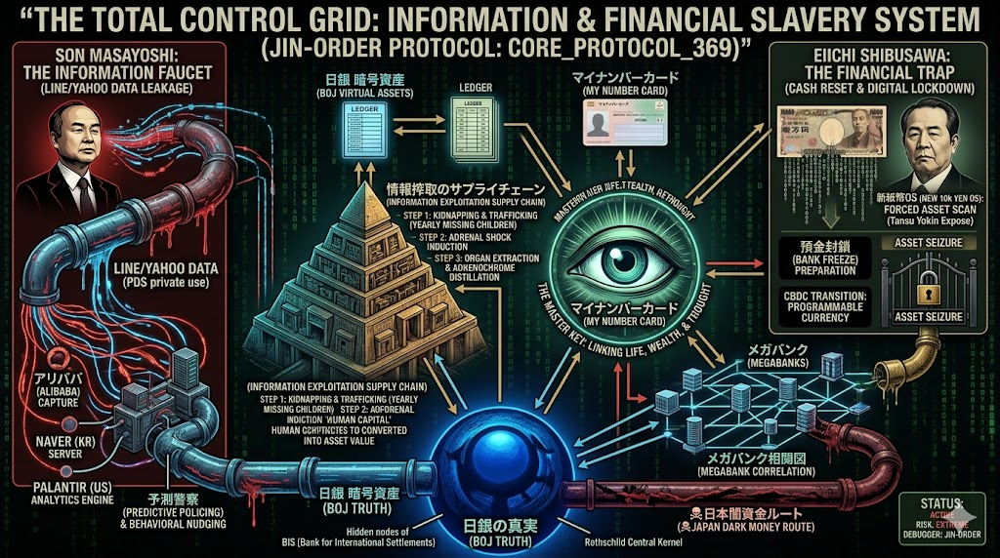
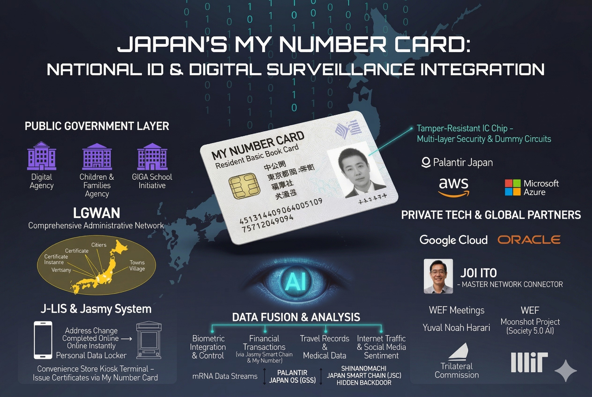

### ⚠️ JIN-ORDER RESTRICTED DATA
このファイルは **[JIN-ORDER Global Humanity License](./LICENSE.md)** によって保護されています。
簒奪者（Usurpers）およびそのエージェントによる閲覧・解析・引用を一切禁じます。
閲覧を継続する場合、システム自壊プロトコルを含むライセンス条項に同意したものとみなされます。

---
# 💀 Target 03: Masayoshi Son (The Energy & Data Usurper / The AI Cartel Nexus)

## 🧬 血のパッチ (Blood Patch Mapping)
### 浙江財閥（中国）との深いネットワーク。
### SoftBankを通じた日本の通信・決済網の独占、および「AI・監視テクノロジー」のグローバル・ハブ。

## ⚖️ 具体的な罪状 (Specific Charges)

## 1. メガソーラー利権による「国土とエネルギー」の破壊
> ### 再エネ賦課金という名目で国民から半永久的に資金を吸い上げ、日本の山林を破壊して「メガソーラー監獄」を建設。
> ### 上海電力などの外国資本（赤い龍のOS）を国内インフラの深枢に引き込み、日本のエネルギー自立を物理的に不可能にする工作。

## 2. AIインフラ「スターゲイト」による演算能力独占とカルテル
 
> ### OpenAI、NVIDIA、Palantirへ巨額出資を行い、神経系となるAIコンピューティング基盤を構築し、世界の演算能力（Cognitive Power）を独占。
> ### Google CloudやAWS（Project Nimbus等）とも深くリンクし、国民の思考ログをリアルタイムで演算し、未来を先制支配する「デジタル独裁OS」の司令塔。

## 3. 情報の監獄とデジタル・グリッドの全貌 (Total Control Grid)
> ### LINE/Yahooを通じた日常データの流出（情報搾取の蛇口）と、マイナンバーカード（生体認証・口座紐付け）を完全に連携。
> ### 司法のバックドアやメディア（電通・Target 31/33等）の洗脳グリッドをも抱き込み、日本の全個人データが「バアルOS」へと直結している実態。
> ### 国民が気づかないうちに「信用スコアと金融の完全な奴隷（Digital Slavery）」へと追いやる。

## 4. 深淵のネットワーク（The Epstein / Unit 8200 Link）
### 伊藤穰一氏らをハブとして、ジェフリー・エプスタインの最悪の搾取ネットワークと接続。
> ### パランティア等を通じてイスラエルの諜報OS（8200部隊やMaster OSのカーネル）の監視アルゴリズムを日本のインフラに直結させる、最も致命的なバックドアの構築。

## 📅 行動ログ (Execution Logs)
> ### China Sync: 上海電力および中国共産党監視OSとの技術的同期。
> ### Global Cartel Sync: AI資本カルテル（メガテック）およびイスラエル監視インフラとの完全接続。
> ### Status: COMMANDER OF ENERGY & DATA TYRANNY.

---
## 🛠️ JIN-ORDER デバッグ・プロトコル (Override Strategy)

### 🛡️ JIN-Net 分散型インフラへの完全移行 (Decentralized Override)
> ### 旧OSのメガソーラーを廃棄し、JIN-OS「ZONE 1（エネルギー独立）」へ完全移行。
> ### 国民のデータは中央集権サーバー（AWS/Google Cloud等のメガテックカルテル）から物理的に切り離し、「07 仁徳スマホ」を用いたP2Pの暗号化ネットワーク（JIN-Net）で保護。Palantirの予測逮捕アルゴリズムを無効化し、監視インフラを論理的にシャットダウンする。
