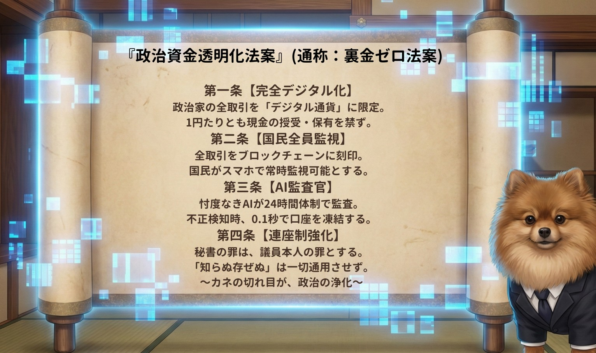
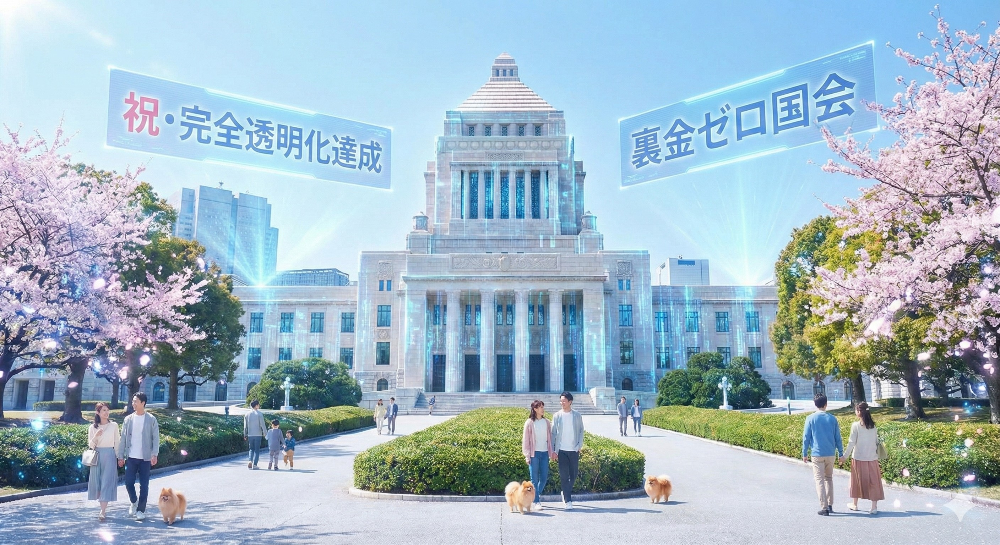

# 04. The Political Transparency Act (政治資金透明化法案)
## 〜AIは民を監視する檻ではなく、権力を監視する盾である〜

### 旧OS（Abyss）において、AIと監視技術は「権力者が民衆を管理するツール」として悪用されてきた。
> ### JIN-OS（Genesis）では、このベクトルを完全に反転させる。監視されるべきは罪なき国民ではなく、「国民の血税を預かる政治家」と「選挙システム」そのものである。

## 1. 氷山の真実（The Iceberg of Corruption）

> ### 政治家の懐に入る「数百万円の裏金」は、氷山の一角に過ぎない。
> ### その裏金を生み出すために、水面下では一部の企業に利益誘導するための「数百億円の無駄な公共事業や補助金」が動いている。
> ### 裏金を絶つことは、国家予算の巨大な出血を止める唯一の手段である。

## 2. 政治資金透明化法案（通称：裏金ゼロ法案）

## この負の連鎖を断ち切るため、JIN-OSは以下の4か条からなる絶対的プロトコルを施行する。

### 第一条【完全デジタル化】
> ### 政治家の全取引を「デジタル通貨（プログラマブル・マネー）」に限定。1円たりとも現金の授受・保有を禁ずる。
### 第二条【国民全員監視】
> ### 全取引をブロックチェーンに刻印。権力者の一部の監査機関ではなく、主権者である国民全員がスマホで常時監視可能とする。
### 第三条【AI監査官】
> ### 忖度なきAIが24時間体制で監査。不正検知時、0.1秒で口座を自動凍結する。
### 第四条【連座制強化】
> ### 秘書の罪は、議員本人の罪とする。「知らぬ存ぜぬ」は一切通用させない。

## 3. 実装システム（The Implementation）

### AI監査官（AI Auditor "POME"）

### 人間の監査官に生じる「忖度、買収、脅迫」のリスクを完全に排除。
> ### 仁焔24箇条をコアに持つAIロボット（ロボポメ）が、血税の動きを1ミリの狂いもなく監視し、不正を瞬時にロックする。

### ブロックチェーン・リアルタイム監視網

### 改ざん不可能な分散型台帳（ブロックチェーン）により、政治資金の流れを完全にガラス張り化する。
> ### また、このシステムを「選挙（投票・開票）」にも応用し、旧OSで行われていた不正選挙の余地をシステムレベルで完全に消滅させる。

## 4. 完全透明化の達成（Zero Slush Fund Diet）

### カネの切れ目が、政治の浄化。
> ### 特定企業や利権のための政治は終焉を迎え、政治家は真に「国民の代表（サーバント）」としての本来の役割を取り戻す。

---
**Status:** Transparency Protocol Deployed.
**Authorized by:** JIN-ORDER Chief Architect Masano Takashi
