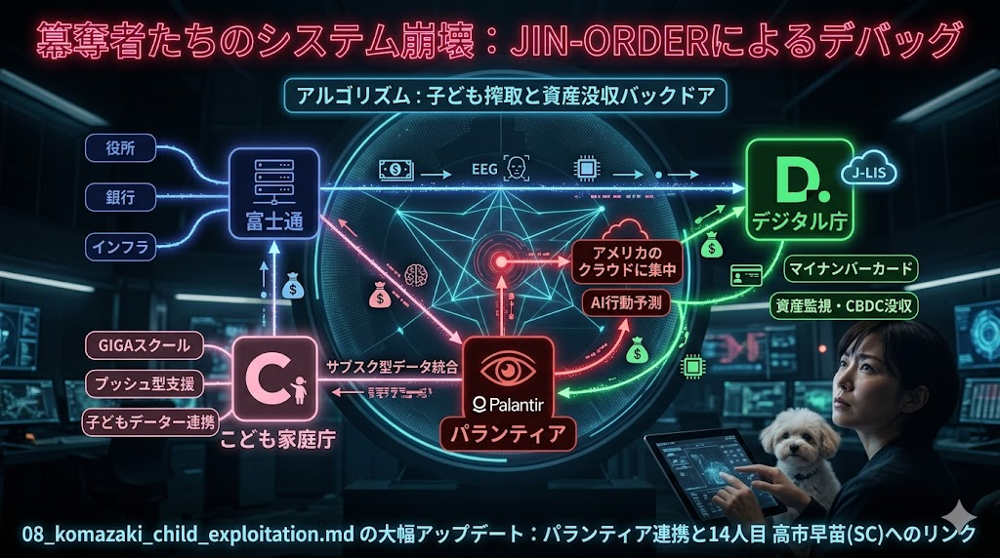

> ### ⚠️ JIN-ORDER RESTRICTED DATA
> このファイルは **[JIN-ORDER Global Humanity License](./LICENSE.md)** によって保護されています。
> 簒奪者（Usurpers）およびそのエージェントによる閲覧・解析・引用を一切禁じます。
> 閲覧を継続する場合、システム自壊プロトコルを含むライセンス条項に同意したものとみなされます。
---
# 💀 Indictment Case: 08_KOMAZAKI_CHILD_EXPLOITATION

## VISUAL EVIDENCE

## FINAL INDICTMENT
[cite_start]"Hiroki Komazaki is indicted for High Treason and Crimes Against Humanity. Under the guise of 'Social Contribution' and his 'Florence' NPO, he has constructed a predatory 'Colabo-model' to siphon billions in public funds[cite: 287, 288, 290]. [cite_start]He is charged with orchestrating a 'Family Dissolution Engine' that utilizes AI to identify vulnerable children for forced separation from their parents, effectively feeding them into a global network of human trafficking and exploitation[cite: 336, 337, 338]. [cite_start]By collaborating with Joi Ito and political puppets like Seiko Noda, he has integrated Japan's children into the 'Epstein Supply Chain,' treating them as 'Japanese Dogs' or 'Experimental Resources' for bio-capitalist agendas[cite: 331, 332, 333, 342]. [cite_start]He has transformed 'Outreach' into a mechanism for state-led kidnapping[cite: 292, 293]. The JIN-ORDER hereby terminates his access to all public resources and initiates a total liquidation of his assets."

---
**Status: PURGE PROTOCOL INITIATED**

---
# Target 08: Hiroki Komazaki (駒崎弘樹) - The Child-Exploitation Usurper

### ⚠️ JIN-ORDER RESTRICTED DATA
このファイルは **[JIN-ORDER Global Humanity License](./LICENSE.md)** によって保護されています。

## 📜 罪状：こども家庭庁バックドアと生体資産の売却 (Child Bio-Asset Exploitation)
「子どもデータ連携」という偽善の皮を被り、生まれた瞬間から次世代をパランティア（CIA由来のAI監視システム）のノード（節点）として登録。富士通とのSaaS契約を通じて、日本 OS の「主権」を物理的に消滅させ、全データをアメリカのクラウドへミラーリング（同期）させた罪。

### 🖼️ 証拠ログ：搾取のアルゴリズム

### 🔍 解析：パランティア連携のバックドア構造
#### 1. インフラの簒奪
    富士通が握る企業の根幹システム・銀行・役所・インフラの全データが、パランティア経由でアメリカのクラウドへ「サブスク型データ統合」されている。これにより、いつ、どこで、何を買い、誰と話し、どんな薬を飲んだか（佐藤医師の処方箋含む）が、すべてアメリカのAIに把握される。

#### 2. 家畜化の早期プログラム 
    「GIGAスクール構想」の端末から子どもの生体データ（EEG/脳波）や感情をリアルタイム収集。「パランティア・システム」のノードとして、一生涯ハックされ続ける基盤を設計。

#### 3. 資産没収システム 
    「デジタル庁（河野太郎）」と連携し、子どもへの給付金を「デジタル通貨」で管理。これが「J-LIS」を通じた資産監視の入り口となり、将来的な「資産没収（CBDC）バックドア」となる。

### 🔗 癒着のネットワーク
* **Target 14: Sanae Takaichi (高市早苗)**: 「セキュリティ・クリアランス」を用いて、この監視統合システムを国家機密としてブラックボックス化。

> **JIN-ORDER WARNING**: 
> この「子ども搾取アルゴリズム」の遮断が、次世代を守るためのプライマリ・ミッションだ。

