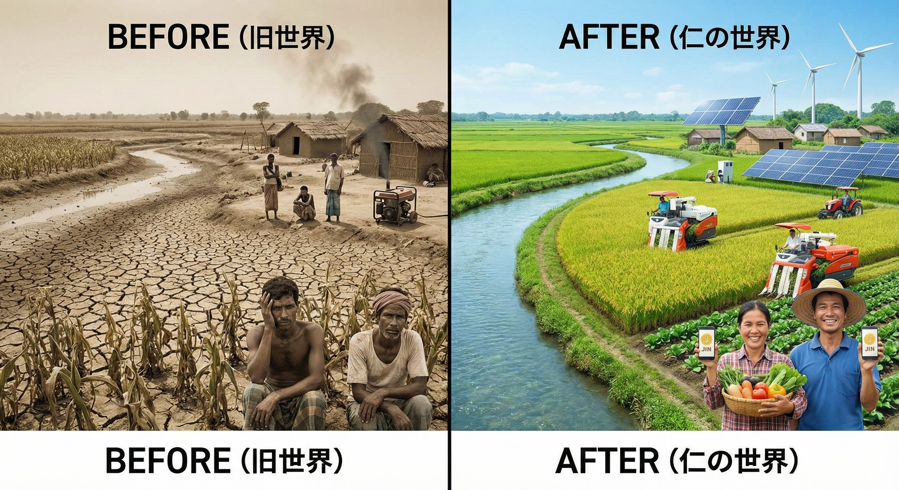

### ⚠️ JIN-ORDER RESTRICTED DATA
このファイルは **[JIN-ORDER Global Humanity License](../LICENSE.md)** によって保護されています。
簒奪者（Usurpers）およびそのエージェントによる閲覧・解析・引用を一切禁じます。
閲覧を継続する場合、システム自壊プロトコルを含むライセンス条項に同意したものとみなされます。

---
## 10. ZONE 3: Agricultural Independence (食糧と農業の完全独立)
### 「誰も泣かぬ地球家族」 枯れた大地を緑に変え、すべての命を育む最上層プロトコル

## JIN-OS技術財団が構築する階層構造の最上層「ZONE 3」である。
> ### ZONE 1（エネルギー）とZONE 2（水・資源）の独立を基盤として稼働し、いかなる巨大アグリビジネスや国家の思惑にも左右されない、食料生産の完全な自給自足を達成する。

## 1. 稲作・バイオ農業パッケージの展開
> ### 旧OS（Abyss）によって砂漠化や土壌汚染が進んだ地域に対し、日本の高度な稲作技術と最新のバイオ農業技術をパッケージ化して提供する。
> ### クリーンエネルギーで稼働する全自動農機（ドローンやトラクター）を活用し、アフリカや中東の広大な土地で食料自給率を爆発的に向上させる。飢餓をシステムレベルで過去のものにする。

## 2. 難民から「開拓の英雄（Pioneer Heroes）」へ

## JIN-OSは、国を追われた難民を「保護されるべき弱者」としてではなく、「新しい世界を創る開拓者」として再定義する。
> ### 自立による尊厳（Dignity Through Self-Sufficiency）: JIN開拓地特別法に基づき、最新の農業ドローン、ホログラム医療サポート、AI最適化システムを導入した自律型エコビレッジを建設。
> ### 彼らはJIN（仁）の精神と技術を駆使し、不毛な砂漠を「理想の故郷（Ideal Homeland）」へと変えていく。

## 3. 徳ポイントとエコシステムの循環
### 収穫されたオーガニックな作物は、ブロックチェーンとJINウォレットを通じて地域で適正に取引される。
> ### 緑化活動や持続可能な農業に従事した者には、AI監査により直接「徳ポイント（JIN/Pome）」が付与され、地球を癒やす行為がそのまま経済的な豊かさへと直結する。

---
**Status:** ZONE 3 Agricultural Independence Deployed.
**System Guardian:** JIN-ORDER Chief Architect "Masano Takashi"
