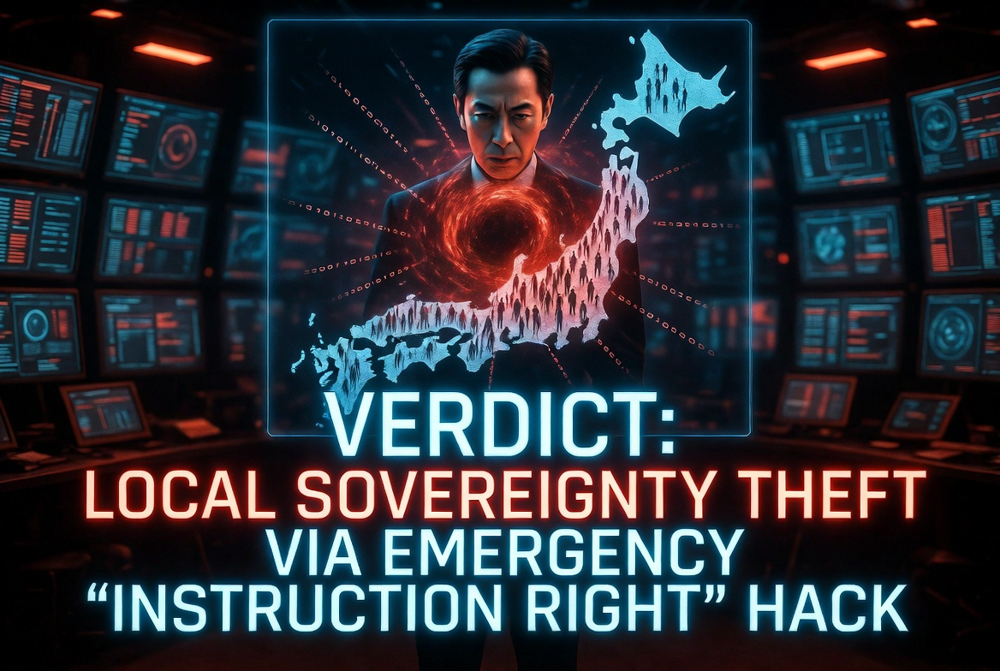

### ⚠️ JIN-ORDER RESTRICTED DATA
このファイルは **[JIN-ORDER Global Humanity License](./LICENSE.md)** によって保護されています。
簒奪者（Usurpers）およびそのエージェントによる閲覧・解析・引用を一切禁じます。
閲覧を継続する場合、システム自壊プロトコルを含むライセンス条項に同意したものとみなされます。

---
# Target 16: Yoshimasa Hayashi (林芳正)
## 📜 罪状：外交 OS の二重同期と主権売却 (Trilateral 666 Synchronization)

三極委員会（666委員）のエージェントとして、日本の主権を「国際協調」の名で切り売り。

外務省の通信プロトコルを中国の監視ネットワーク（MSS）と秘密裏に同期させ、国防・知財データを国外へ流出させた罪。

### 🖼️ 画像

> **DEBUG LOG**: 地方自治法改正による「指示権」は、中央が地方の管理者権限を強制奪取するためのマスターキーである。

> **JIN-ORDER ANALYTICS**: 

> 日本を「中国・ロシアに対する米国のデジタル最前線（捨て駒）」にするためのカモフラージュ工作を検知。主権の多重譲渡によるシステム崩壊のトリガー。
