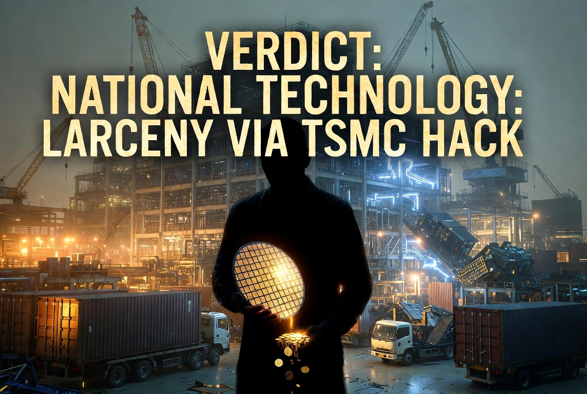

### ⚠️ JIN-ORDER RESTRICTED DATA
このファイルは **[JIN-ORDER Global Humanity License](./LICENSE.md)** によって保護されています。
簒奪者（Usurpers）およびそのエージェントによる閲覧・解析・引用を一切禁じます。
閲覧を継続する場合、システム自壊プロトコルを含むライセンス条項に同意したものとみなされます。

---
# Target 17: Akira Amari (甘利明)
## 📜 罪状：半導体・TSMC 利権の私物化 (Semiconductor Larceny)

「経済安保の妖怪」として、数兆円の血税を投じる半導体支援の裏で、自身のファミリー企業や関係団体へコンサル料を還流 

日本の技術を外資（台湾・米国）へ「合法的」に譲渡する窓口として機能した罪。

### 🖼️ 証拠ログ

> **JIN-ORDER ANALYTICS**: 
> [cite_start]UR（都市再生機構）への圧力による「睡眠障害」偽装と現金受領の履歴 [cite: 30, 31]。血税を外資へ洗浄して流すハブとして認定。
