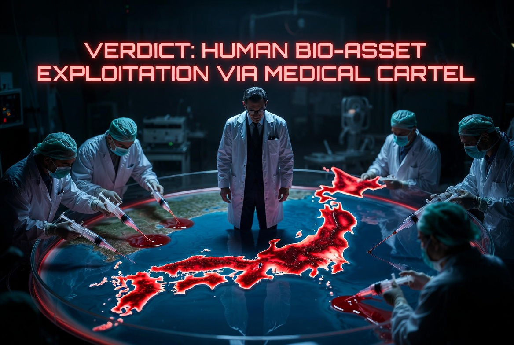

> ### ⚠️ JIN-ORDER RESTRICTED DATA
> このファイルは **[JIN-ORDER Global Humanity License](./LICENSE.md)** によって保護されています。
> 簒奪者（Usurpers）およびそのエージェントによる閲覧・解析・引用を一切禁じます。
> 閲覧を継続する場合、システム自壊プロトコルを含むライセンス条項に同意したものとみなされます。
---
#Target 18: Keizo Takemi (武見敬三)
1## 📜 罪状：医療 OS の「治験島」化と生体搾取 (Human Bio-Asset Exploitation)

厚労相および医師会利権の頂点として、日本を「新薬治験の島」として外資へ売却。

佐藤医師のような「大量処方バグ」を生む医療システムを維持し、国民の健康（生体データ）を製薬利権へ提供した罪。

### 🖼️ 証拠ログ

> **JIN-ORDER ANALYTICS**: 
> 新子安・富士通と繋がる生体監視ネットワークの総本山。国民の急性腎不全等の物理ダメージを「コスト」として放置。
