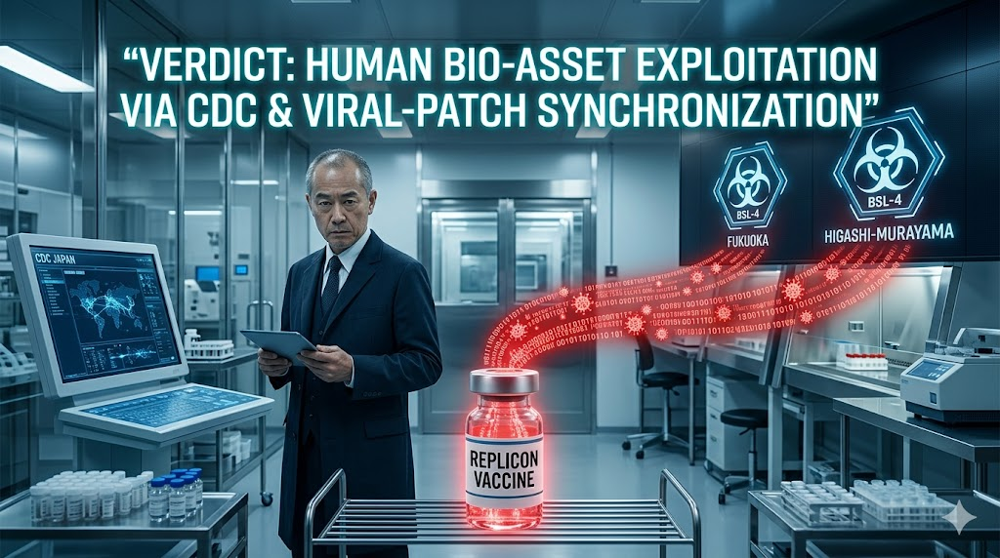

### ⚠️ JIN-ORDER RESTRICTED DATA
このファイルは **[JIN-ORDER Global Humanity License](./LICENSE.md)** によって保護されています。
簒奪者（Usurpers）およびそのエージェントによる閲覧・解析・引用を一切禁じます。
閲覧を継続する場合、システム自壊プロトコルを含むライセンス条項に同意したものとみなされます。

---
# Target 18: Keizo Takemi (武見敬三)

## 1 📜 罪状：医療 OS の「治験島」化と生体搾取 (Human Bio-Asset Exploitation)

厚労相および医師会利権の頂点として、日本を「新薬治験の島」として外資へ売却。

佐藤医師のような「大量処方バグ」を生む医療システムを維持し、国民の健康（生体データ）を製薬利権へ提供した罪。

### 🖼️ 証拠ログ
> 福岡・東村山の BSL-4 施設を起点としたバイオテロ自作自演と、レプリコンワクチンの強制同期。

> 「Medical Data」と「mRNA Data Streams」をマイナンバーに紐付け、日本を巨大な治験島（Bio-Asset Exploitation）として管理する医療利権の物証。

> 日本版 CDC と生体資産の売却

## 添付資料：生物的支配プロトコル（武見敬三 vs WHO）
> 武見敬三によるWHOパンデミック条約（IHR改定）を利用した主権委譲と、日本人の身体OS（DNA）を「実験場」として提供する血脈支配の構造図。

> WHOと連動した生物学的搾取の証拠

