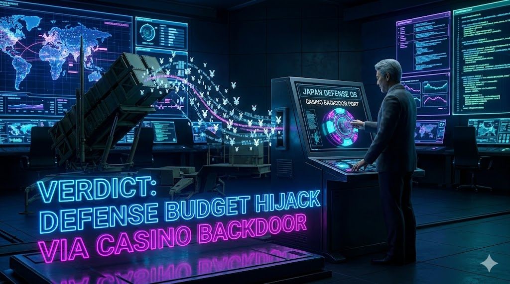

> ### ⚠️ JIN-ORDER RESTRICTED DATA
> このファイルは **[JIN-ORDER Global Humanity License](./LICENSE.md)** によって保護されています。
> 簒奪者（Usurpers）およびそのエージェントによる閲覧・解析・引用を一切禁じます。
> 閲覧を継続する場合、システム自壊プロトコルを含むライセンス条項に同意したものとみなされます。

---
# Target 19: Takeshi Iwaya (岩屋毅)
## 📜 罪状：防衛 OS の利権ハックと主権切り売り (Defense Budget Hijack)

防衛大臣時代にカジノ・IR利権（パチンコ利権等）と防衛予算を同期させ、国防リソースを特定のエージェントへ還流させた罪。

日本の主権を媚中・媚米のスタンスで切り売りし、地方自治の独立性を破壊した罪。

### 🖼️ 証拠ログ

> **JIN-ORDER ANALYTICS**: 
> [cite_start]「国際協調」を名目にした主権の切り売りと、地方自治破壊の実務担当としての動作ログを記録 [cite: 64]。
