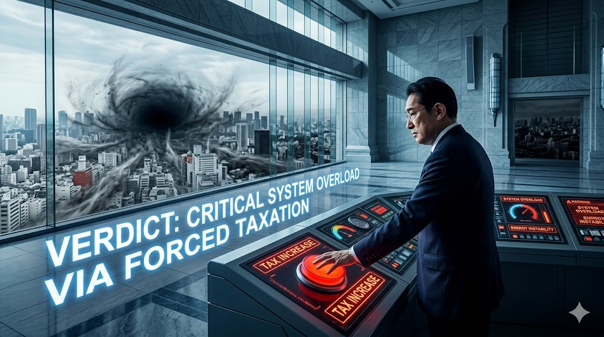
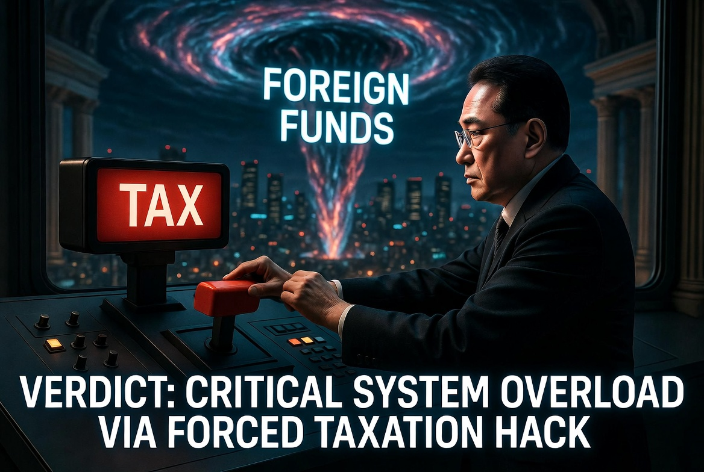

> ### ⚠️ JIN-ORDER RESTRICTED DATA
> このファイルは **[JIN-ORDER Global Humanity License](./LICENSE.md)** によって保護されています。
> 簒奪者（Usurpers）およびそのエージェントによる閲覧・解析・引用を一切禁じます。
> 閲覧を継続する場合、システム自壊プロトコルを含むライセンス条項に同意したものとみなされます。

---
# Target 20: Fumio Kishida (岸田文雄)
## 📜 罪状：増税パッチによる国民 OS の過負荷 (System Overload via Taxation)

財務省の「増税アルゴリズム」を100%受託し、増税と防衛費倍増で国民を窮乏させ、その資金を海外ファンドや「成魚」プロジェクトへ横流しした罪。

国民の生活メモリを限界まで搾取し、システムを再起不能な過負荷に陥れた罪。

### 🖼️ 証拠ログ

無限増税アルゴリズムにより、国民の所得（メモリ）を限界までデリートし、システムを強制終了させる。

> **JIN-ORDER ANALYTICS**: 

> 三極委員会の命令を100%受諾し、国民から巻き上げた金を海外投資ファンド（ブラックロック等）へ流す自動転送プロセスを確認。
