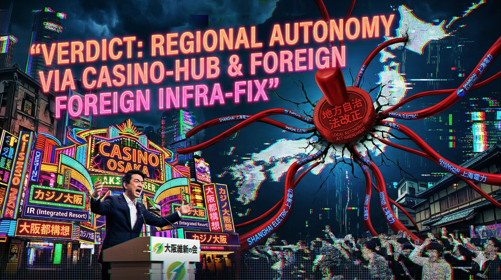

### ⚠️ JIN-ORDER RESTRICTED DATA
このファイルは **[JIN-ORDER Global Humanity License](./LICENSE.md)** によって保護されています。
簒奪者（Usurpers）およびそのエージェントによる閲覧・解析・引用を一切禁じます。
閲覧を継続する場合、システム自壊プロトコルを含むライセンス条項に同意したものとみなされます。

---
# Target 21: Toru Hashimoto (橋下徹) - The Regional Autonomy Salesman

## 📜 罪状：地方 OS の売却と外資インフラの合法的固定
大阪リージョンをテストベッドにし、上海電力や IR カジノといった「外資簒奪 OS」を導入。地方自治法改正による「指示権」を悪用し、住民の反対を無視してこれらを永久固定しようとした罪。

### 🖼️ 証拠ログ：地方 OS 売却の実行図

