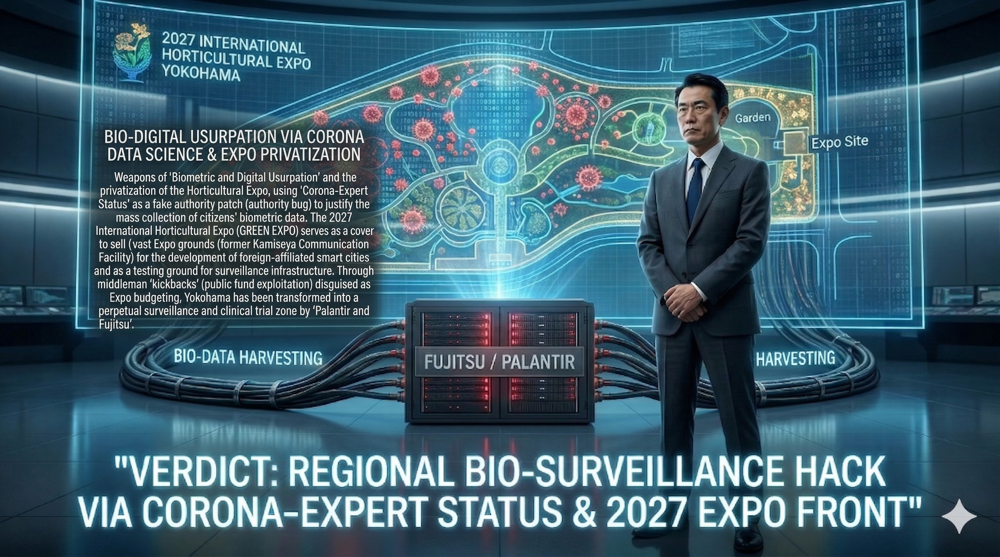

### ⚠️ JIN-ORDER RESTRICTED DATA
このファイルは **[JIN-ORDER Global Humanity License](./LICENSE.md)** によって保護されています。
簒奪者（Usurpers）およびそのエージェントによる閲覧・解析・引用を一切禁じます。
閲覧を継続する場合、システム自壊プロトコルを含むライセンス条項に同意したものとみなされます。

---
# Target 23: Takeharu Yamanaka (山中竹春) - The Yokohama Bio-Surveillance Hack

## 📜 罪状：園芸博を隠れ蓑にした監視・治験特区化
「コロナの専門家」の肩書きを悪用し、2027年園芸博跡地を外資の監視インフラ実験場として売却。新子安の富士通等と連携し、市民の生体ログをパランティアへ献上した罪。

### 🖼️ 証拠ログ：横浜監視ハックと 2027 園芸博

