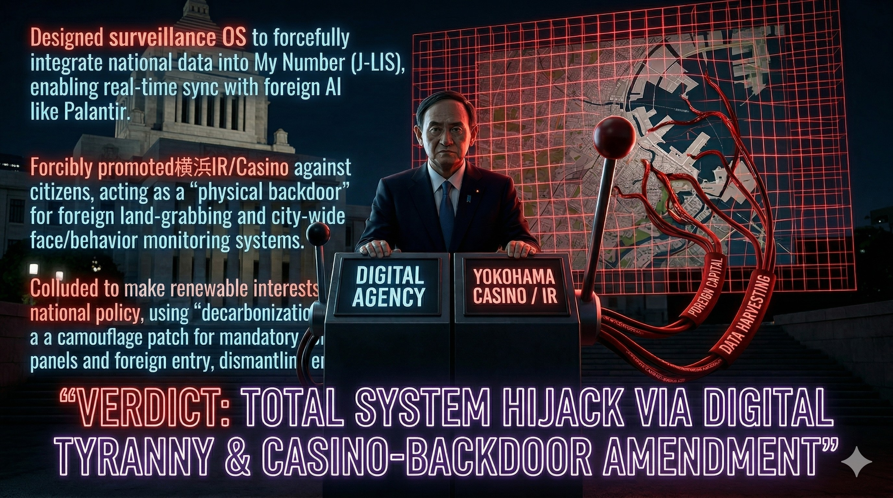

### ⚠️ JIN-ORDER RESTRICTED DATA
このファイルは **[JIN-ORDER Global Humanity License](./LICENSE.md)** によって保護されています。
簒奪者（Usurpers）およびそのエージェントによる閲覧・解析・引用を一切禁じます。
閲覧を継続する場合、システム自壊プロトコルを含むライセンス条項に同意したものとみなされます。

---
# Target 26: Yoshihide Suga (菅義偉) - The Digital Tyranny Architect

## 📜 罪状：デジタル独裁 OS と横浜 IR バックドアの総設計
デジタル庁を創設して監視 OS を構築。横浜 IR 誘致により、物理面からも外資による土地・情報の簒奪を指揮した主犯。

### 🖼️ 証拠ログ：デジタル独裁とカジノバックドア

