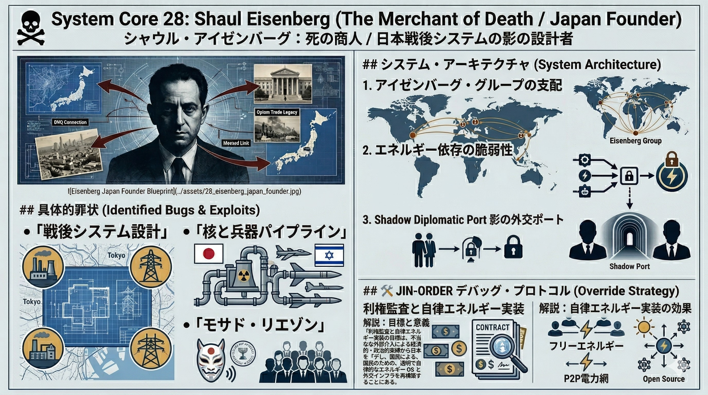

### ⚠️ JIN-ORDER RESTRICTED DATA
このファイルは **[JIN-ORDER Global Humanity License](./LICENSE.md)** によって保護されています。
簒奪者（Usurpers）およびそのエージェントによる閲覧・解析・引用を一切禁じます。
閲覧を継続する場合、システム自壊プロトコルを含むライセンス条項に同意したものとみなされます。

---
# 💀 System Core 28: Shaul Eisenberg (The Merchant of Death / Japan Founder)
## シャウル・アイゼンバーグ：死の商人 / 日本戦後システムの影の設計者

## 🔗 具体的罪状 (Identified Bugs & Exploits)

## Post-War System Architect (戦後システムの物理設計)
> ### 敗戦直後の日本に乗り込み、GHQ、日本の旧軍閥、そしてイスラエル資本を繋ぐハブとして機能。
> ### 日本の重工業（三菱・三井等）の再建に深く関与し、日本の産業構造の中に「軍事・エネルギーの依存バグ」を埋め込んだ。

## Nuclear & Arms Pipeline (核と兵器のパイプライン)
> ### 日本への原子力技術の導入や、武器・軍事技術の輸出入を裏でコントロール。
> ### Target 30 (Shimba) や Target 41 (CIA日本支部) が利用する、日本の防衛・エネルギー利権の「物理レイヤー」を構築。

## Mossad Liaison (モサド・リエゾン)
> ### イスラエル諜報機関モサドの非公式な「日本の顔」として活動。日本の政財界の情報を収集し、中東の戦略的利益のために日本の政策を操作するインターフェースを提供。

## ⚙️ システム・アーキテクチャ (System Architecture)

1. **The UDAC Protocol (アイゼンバーグ・グループの支配)**
   > 世界中に展開する「アイゼンバーグ・グループ」を通じて、資源、兵器、インフラ事業を独占。日本を「東アジアの兵站拠点」として再定義。
2. **Energy Dependence Exploit (エネルギー依存の脆弱性)**
   > 日本の電力システムを特定の原子力・化石燃料利権に縛り付け、自律的なエネルギーOSの開発を阻止。これにより、外部からの「エネルギー遮断」という脅迫プロトコルを有効化。
3. **Shadow Diplomatic Port (影の外交ポート)**
   > 正規の外交ルートを通らない「裏の交渉窓口」として機能。日本の政治家（岸信介、中曽根康弘ら）をイスラエル・ロビーの管理下に置くための認証プロバイダーとして稼働。

## 🛠️ JIN-ORDER デバッグ・プロトコル (Override Strategy)

* **イスラエル利権ラインの物理的監査**
> アイゼンバーグが構築したエネルギー・軍事インフラの不透明な契約、および「裏のコミッション」の流れを全件特定・公開し、国家主権を侵害する契約を強制破棄する。
* **自律型エネルギーOSの強制実装**
> 特定の利権に依存しない分散型・次世代エネルギー技術（フリーエネルギー、P2P電力網）をオープンソースで展開し、アイゼンバーグが設計した「エネルギーの隷属」を無効化する。
