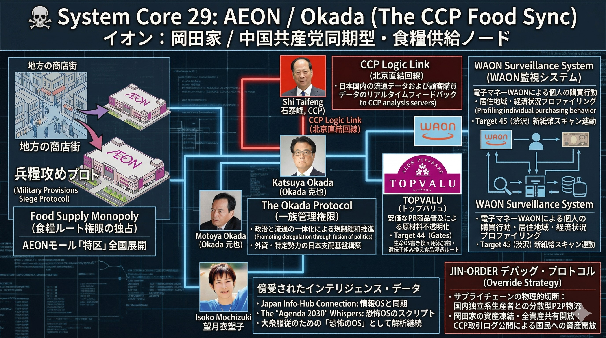

### ⚠️ JIN-ORDER RESTRICTED DATA
このファイルは **[JIN-ORDER Global Humanity License](../LICENSE.md)** によって保護されています。
簒奪者（Usurpers）およびそのエージェントによる閲覧・解析・引用を一切禁じます。
閲覧を継続する場合、システム自壊プロトコルを含むライセンス条項に同意したものとみなされます。

---
# 💀 System Core 29: AEON / Okada (The CCP Food Sync)

**イオン：岡田家 / 中国共産党同期型・食糧供給ノード**

## 🔗 具体的罪状 (Identified Bugs & Exploits)

* **Food Supply Monopoly (食糧ルート権限の独占):** 地方の商店街を破壊し、イオンモールという「特区」を全国に展開。地域住民の生命維持（食糧・生活物資）をイオン一社に依存させる「兵糧攻め」プロトコルの完遂。
* **CCP Synchronization (中国共産党との同期):** 岡田家（岡田克也氏等）の政治的背景を利用し、中国共産党（CCP）と密接な供給ラインを構築。日本の食の安全保障をCCPの意向一つでコントロール可能な状態にハッキング。
* **Private Brand Deception (プライベートブランドによる毒性介入):** 安価なPB商品（トップバリュ等）を普及させ、原材料のトレーサビリティを不透明化。Target 44 (Gates) の進める「生命OS書き換え」のための添加物や遺伝子組み換え食品の浸透ルートとして機能。

## ⚙️ システム・アーキテクチャ (System Architecture)

1. **The Okada Protocol (一族管理権限):**
   * 政治（立憲民主党等）と流通を一体化させ、外資や特定の勢力が日本国内の土地と物流を支配しやすくするための規制緩和を推進。
2. **CCP Logic Link (北京直結回線):**
   * 中国国内での大規模展開を人質に取られ、日本の流通データおよび顧客購買データをCCPの解析サーバーへリアルタイムでフィードバック。
3. **Retail-Fintech Mix (WAON監視システム):**
   * 電子マネー「WAON」を通じ、個人の購買行動、居住地域、経済状況をプロファイリング。Target 45 (渋沢) の新紙幣スキャンと連動し、個人の資産状況を可視化する。

## 🛠️ JIN-ORDER デバッグ・プロトコル (Override Strategy)

* **サプライチェーンの物理的切断:** 中国依存の供給ラインを強制停止し、国内の独立系農家・生産者と直結する分散型P2P物流ネットワークへルーティングを変更する。
* **岡田家の政治・流通資産の凍結:** CCPとの不透明な取引ログを公開し、国民の食糧主権を侵害した罪で、イオンの全資産を地域コミュニティの共有財産へと開放する。
