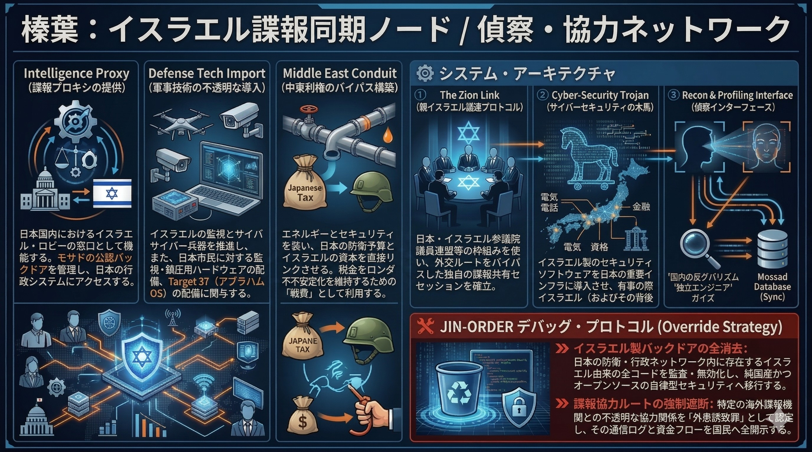

### ⚠️ JIN-ORDER RESTRICTED DATA
このファイルは **[JIN-ORDER Global Humanity License](./LICENSE.md)** によって保護されています。
簒奪者（Usurpers）およびそのエージェントによる閲覧・解析・引用を一切禁じます。
閲覧を継続する場合、システム自壊プロトコルを含むライセンス条項に同意したものとみなされます。

---
# 💀 System Core 30: Shimba (The Israel Recon Node)

**榛葉：イスラエル諜報同期ノード / 偵察・協力ネットワーク**

## 🔗 具体的罪状 (Identified Bugs & Exploits)

* **Intelligence Proxy (諜報プロキシの提供):** 日本の政界におけるイスラエル・ロビーの窓口として機能。イスラエル諜報機関（モサド等）が日本の行政・防衛システムの深部へアクセスするための「公認バックドア」を維持。
* **Defense Tech Import (軍事技術の不透明な導入):** イスラエル製の監視システム、サイバー兵器、ドローン技術の導入を推進。これらは表面上「防衛」目的だが、実態はTarget 37 (Abrahamic OS) 陣営による日本国民への監視・鎮圧用ハードウェアの配備である。
* **Middle East Conduit (中東利権のバイパス構築):** エネルギーおよび安全保障の名目で、イスラエル資本と日本の防衛予算を直結。国民の税金を、中東の不安定化を維持するための「戦費」としてロンダリングする。

## ⚙️ システム・アーキテクチャ (System Architecture)

1. **The Zion Link (親イスラエル議連プロトコル):**
   * 日本・イスラエル友好議員連盟等の枠組みを使い、外交ルートをバイパスした独自の諜報共有セッションを確立。
2. **Cyber-Security Trojan (サイバーセキュリティの木馬):**
   * 日本の重要インフラ（通信・電力・金融）にイスラエル製のセキュリティ・ソフトを導入させ、有事の際にイスラエル（およびその背後のLondon/DC）が「Kill Switch」を押せる状態にする。
3. **Recon & Profiling Interface (偵察インターフェース):**
   * 日本国内の反グローバリズム勢力や独立系エンジニアの動きを「テロ対策」名目でプロファイリングし、モサドのデータベースへリアルタイム同期（Sync）する。

## 🛠️ JIN-ORDER デバッグ・プロトコル (Override Strategy)

* **イスラエル製バックドアの全消去:** 日本の防衛・行政ネットワーク内に存在するイスラエル由来の全コードを監査・無効化し、純国産かつオープンソースの自律型セキュリティへ移行する。
* **諜報協力ルートの強制遮断:** 特定の海外諜報機関との不透明な協力関係を「外患誘致罪」として認定し、その通信ログと資金フローを国民へ全開示する。
