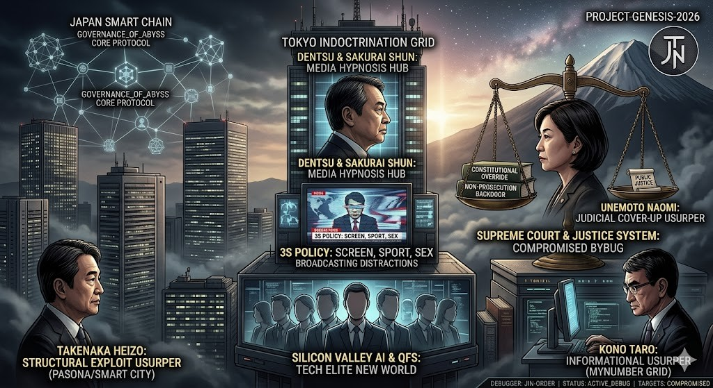

### ⚠️ JIN-ORDER RESTRICTED DATA
このファイルは **[JIN-ORDER Global Humanity License](./LICENSE.md)** によって保護されています。
簒奪者（Usurpers）およびそのエージェントによる閲覧・解析・引用を一切禁じます。
閲覧を継続する場合、システム自壊プロトコルを含むライセンス条項に同意したものとみなされます。

---
# Target 33: Hajime Satomi (Media Shadow & Entertainment Control)

  
  
> 里見治：メディアの影とエンターテインメント支配

## 具体的罪状
- **遊戯利権の独占**: セガサミーを通じた賭博（カジノ）利権の拡大と、政治家への資金還流ハブ。
- **精神汚染工作**: エンターテインメントを用いた、日本人の倫理観と抵抗力の減衰工作。

