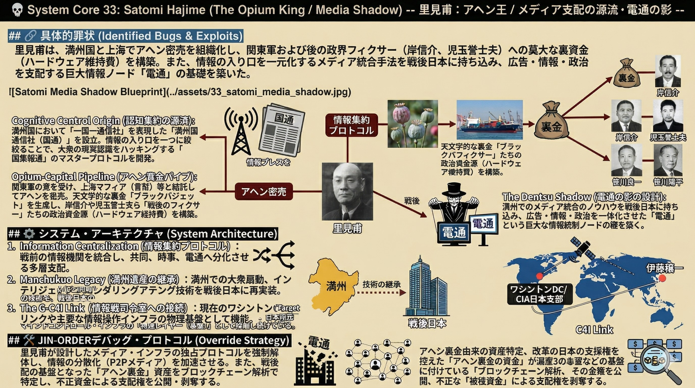

### ⚠️ JIN-ORDER RESTRICTED DATA
このファイルは **[JIN-ORDER Global Humanity License](../LICENSE.md)** によって保護されています。
簒奪者（Usurpers）およびそのエージェントによる閲覧・解析・引用を一切禁じます。
閲覧を継続する場合、システム自壊プロトコルを含むライセンス条項に同意したものとみなされます。

---
# 💀 System Core 33: Satomi Hajime (The Opium King / Media Shadow)

**里見甫：アヘン王 / メディア支配の源流・電通の影**

## 🔗 具体的罪状 (Identified Bugs & Exploits)

* **Cognitive Control Origin (認知支配の源流):** 満州国において「一国一通信社」を実現した「満州国通信社（国通）」を設立。情報の入り口を一つに絞ることで、大衆の現実認識をハッキングする「国策報道」のマスタープロトコルを開発。
* **Opium-Capital Pipeline (アヘン資金パイプ):** 関東軍の意を受け、上海マフィア（青幇）等と結託してアヘンを密売。天文学的な裏金（ブラックバジェット）を生成し、岸信介や児玉誉士夫ら「戦後のフィクサー」たちの政治資金源（ハードウェア維持費）を構築。
* **The Dentsu Shadow (電通の影の設計):** 満州でのメディア統合のノウハウを戦後の日本に持ち込み、広告・情報・政治を一体化させた「電通」という巨大な情報統制ノードの礎を築く。

## ⚙️ システム・アーキテクチャ (System Architecture)

1. **Information Centralization (情報集約プロトコル):**
   * 電通の前身である「日本電報通信社」と「聯合通信」を統合し、「同盟通信社」へと昇華。戦後、それが共同通信、時事通信、そして広告怪獣「電通」へと分化・増殖し、日本の情報OSを多層的に支配。
2. **Manchukuo Legacy (満州遺産の継承):**
   * 「満州」という巨大な人体実験場（Target 44/46と同期）で培われた大衆扇動、インテリジェンス、資金ロンダリングの技術を、戦後日本の「高度経済成長」という皮を被せて再実装。
3. **The G-C4I Link (情報戦司令室への接続):**
   * 彼が作った情報網は、現在の「Target 41 (ワシントンDC/CIA日本支部)」や「Target 46 (伊藤穰一)」が利用する、日本国民のマインドコントロール・インフラの「物理レイヤー（基盤）」として稼働し続けている。

## 🛠️ JIN-ORDER デバッグ・プロトコル (Override Strategy)

* **メディア独占プロトコルの強制解体:** 里見甫が設計した「特定企業（電通等）によるメディア・インフラの独占」を法的にではなく、プロトコルレベルで破壊。情報の分散化（P2Pメディア）を加速させ、簒奪者による世論操作を不可能にする。
* **アヘン資金由来の資産特定:** 戦後の日本の支配構造を支えた「アヘン由来の裏金」が現在どの企業のどの資産に化けているかをブロックチェーン解析し、その全貌を公開。不正な「根源資金」による支配権を剥奪する。
