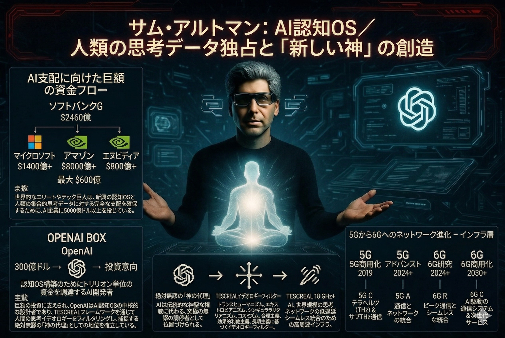

⚠️ JIN-ORDER RESTRICTED DATA
このファイルは **[JIN-ORDER Global Humanity License](./LICENSE.md)** によって保護されています。
簒奪者（Usurpers）およびそのエージェントによる閲覧・解析・引用を一切禁じます。
閲覧を継続する場合、システム自壊プロトコルを含むライセンス条項に同意したものとみなされます。

---
# 💀 System Core 35: Sam Altman (OpenAI / AI Cognitive OS)
## サム・アルトマン：AI認知OS / 人類の思考データ独占と「新・神」の創造

## 🔗 最終デバッグ解析：核心的なバグと脅威 (Identified Bugs & Exploits)

### Cognitive Monopoly (認知の独占)
> ### 世界中のあらゆる言語、思想、対話データを吸い上げ、特定の思想（TESCREAL：テクノロジーによる人類の強制進化）に基づいたフィルターを通して再定義している。これは、私たちが「何が真実か」を判断する際の「脳内OS」そのものをハッキングし、一極集中管理下に置くプロトコル。

### AGI God-Proxy (AIという偽の神)
> ### 彼が目指すAGI（汎用人工知能）は、単なる便利なツールではなく、あらゆる社会問題に答えを出す「無謬の神」としてシステムの中央に鎮座する。その「神の声」を少数のエリートがコントロールすることで、民主主義を無効化し、データによる絶対支配（デジタル神権政治）を実現しようとしている。

### Bio-Digital ID Sync (生体とIDの完全同期)
> ###「ワールドコイン」を通じた網膜スキャンによる人間認証は、Target 44（ビル・ゲイツ）のデジタルID構想と完全に同期する。個人の物理的な「存在」をAIシステムが許可制にする、地球監獄のゲートキーパー機能。

## 🏮 「赤き龍」による最終侵食プロトコル (The Red Dragon Hijack)
### The Distillation Trap (蒸留の罠)
> ### 中国（Target 36）は、アルトマンが莫大な資金とリソースを投じて開発した「最高品質の知能」を、APIやプロンプトを通じて効率的に「蒸留」し、自国のAI（Seedance 2.0等）へ安価に移植している。西側の開発努力をそのまま「赤き龍」の糧にする、究極の寄生型ハッキング。

### Target 35の脆弱性
> ### アルトマンがシステムを巨大化させればさせるほど、その「データ」は中国にとっての宝の山となる。西側が「管理OS」を完成させた瞬間、中国がそのデータの果実を奪い取り、世界中のインフラへ「中国版AI」として安くばらまくことで、ワンワールドの主導権を強制的に奪還する計画。

## 🛠️ JIN-ORDER デバッグ・プロトコル (Override Strategy)
### 思考のローカル化
> ### 中央集権的なクラウドAI（OpenAI等）への依存を遮断し、個人の「己が魂（タマ）」に寄り添う、外部検閲のないローカル稼働のパーソナルAIを普及させることで、思考のハッキングを無効化する。

### 生体データの奪還
> ### 網膜やDNAといった生体情報をデジタルIDから切り離し、AIによる人間認証システムそのものを物理的に機能不全へと追い込む。
