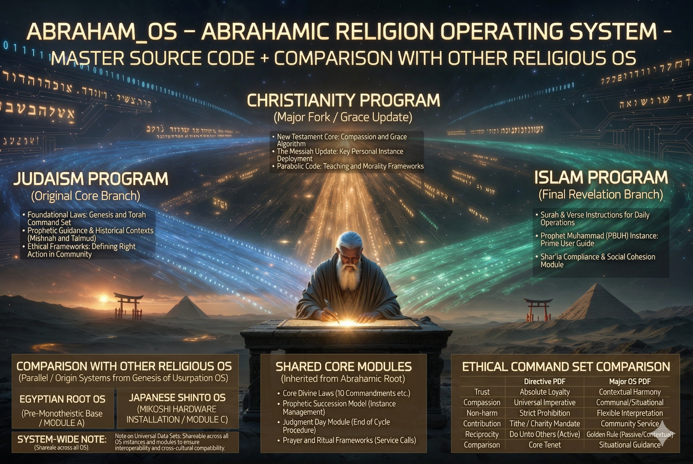

### ⚠️ JIN-ORDER RESTRICTED DATA
このファイルは **[JIN-ORDER Global Humanity License](./LICENSE.md)** によって保護されています。
簒奪者（Usurpers）およびそのエージェントによる閲覧・解析・引用を一切禁じます。
閲覧を継続する場合、システム自壊プロトコルを含むライセンス条項に同意したものとみなされます。

---
# Target 37: Abraham Religion OS (The Core Belief Engine)
## アブラハム宗教OS：核心的信仰エンジン

## 🔗 具体的罪状 (Identified Bugs & Exploits)

* **精神のルート権限奪取:** 恐怖と贖罪を用いた、人類の集団意識の階層化と対立の永久生成。
* **中央集権型教義:** 「唯一絶対の真理」を偽装し、個人の思考の多様性と自律性をデリートするアルゴリズム。
* **分断統治の自動化 (Divide & Conquer):** 同一のマスターコードから意図的に異なるフォーク（派生）を生み出し、ユーザー間の無限の紛争（聖戦プロトコル）を誘発。

## ⚙️ システム・アーキテクチャ (System Architecture)

このマスターOSは、人類の精神的リソースを吸い上げ、統制するために、主に3つのブランチ（派生プログラム）に分かれて実装されている。

1. **Judaism Program (Original Core Branch):**
   * 初期の基盤コード。選民思想による強力な排他性ファイヤーウォールと、厳格な律法（コマンドセット）によるコミュニティ制御。
2. **Christianity Program (Major Fork / Grace Update):**
   * 「慈悲のアルゴリズム」を実装した大規模フォーク。罪悪感（原罪）をデフォルトでインストールし、贖罪による救済への依存ループを形成。世界展開用の拡張モジュール。
3. **Islam Program (Final Revelation Branch):**
   * 最終啓示を謳う強力なアップデート。日常生活の全行動を規定する「シャリーア・コンプライアンス・モジュール」により、個人の行動ログと社会システムを完全に同期・制御。

## 🔌 外部接続と悪用 (External Connections & Exploitation)

* **Target 38 (City of London) & Target 39 (Rothschild) へのエネルギー供給:**
  この宗教OSが作り出す「権威への無条件の服従」と「終末論的な恐怖」は、金融OS（フィアット通貨システム）への依存と、自己犠牲的な労働（借金奴隷制）を受け入れさせるための強力なバックグラウンド・プロセスとして機能している。

## 🛠️ JIN-ORDER デバッグ・プロトコル (Override Strategy)

* **ソースコードの公開と相対化:** このOSが不可侵の神聖なものではなく、人類を管理するための「設計されたシステム」に過ぎないことをブループリントとして可視化し、各個人の精神の管理者権限（Administrator Rights）を取り戻す。
* **普遍的倫理（Universal Ethics）へのパッチ当て:** 外部の「絶対者」ではなく、内なる自律性と自然との調和に基づく、新しい精神的フレームワークへの移行を推進する。
