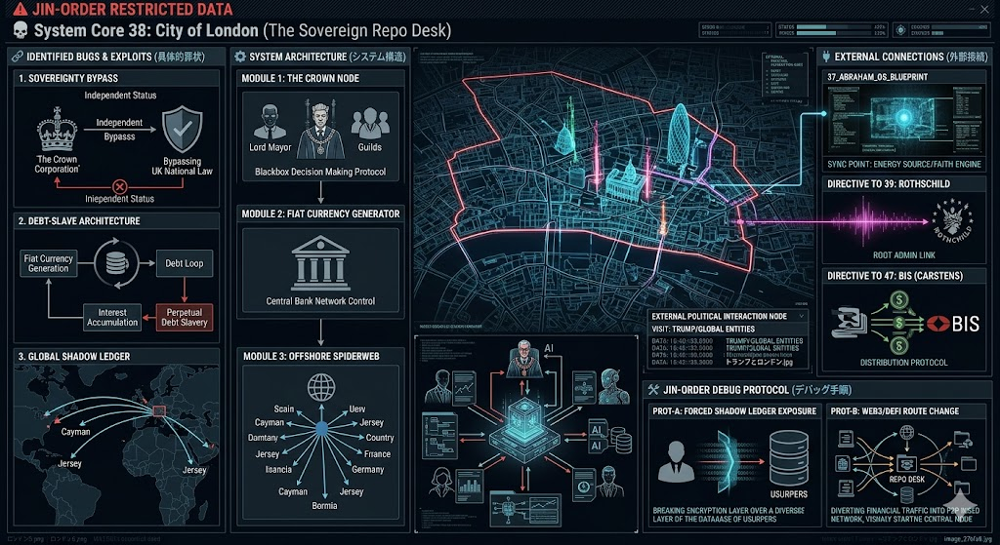

### ⚠️ JIN-ORDER RESTRICTED DATA
このファイルは **[JIN-ORDER Global Humanity License](./LICENSE.md)** によって保護されています。
簒奪者（Usurpers）およびそのエージェントによる閲覧・解析・引用を一切禁じます。
閲覧を継続する場合、システム自壊プロトコルを含むライセンス条項に同意したものとみなされます。

---
# 💀 System Core 38: City of London (The Sovereign Repo Desk)
## シティ・オブ・ロンドン：独立金融特区 / グローバル債務エンジン

## 🔗 具体的罪状 (Identified Bugs & Exploits)

* **国家主権のバイパス (Sovereignty Bypass):** イギリス国家の法律や税制から独立した「法人（The Crown Corporation）」として機能し、国家の上に君臨するシャドー・ガバナンスの構築。
* **負債奴隷制アルゴリズム (Debt-Slave Architecture):** 「無」から信用（フィアット通貨）を創造し、利子という名のバグを利用して全人類を恒久的な借金状態に陥れる無限搾取ループの実装。
* **グローバル資金洗浄ハブ (Global Shadow Ledger):** 世界中のタックスヘイブン（オフショア金融センター）を束ねるマスターノードとして、簒奪者たちの非合法な資産隠しとマネーロンダリングを自動化。

## ⚙️ システム・アーキテクチャ (System Architecture)

この特区は、世界規模の金融トラフィックを監視・操作するための巨大な「レポ・デスク（資金供給司令室）」として機能している。

1.  **The Crown Node (特権階級プロトコル):**
    * 民主主義のアップデートが及ばない、中世から続くギルド（Livery Companies）と市長（Lord Mayor）によるブラックボックス化された意思決定機関。
2.  **Fiat Currency Generator (不換紙幣生成エンジン):**
    * 金本位制（ハードウェア担保）の解除以降、中央銀行ネットワークを通じて世界の流動性をコントロールし、インフレーション（ステルス課税）を発生させる。
3.  **Offshore Spiderweb (オフショア・クモの巣配線):**
    * ケイマン諸島、ジャージー島、バージン諸島などのフロントサーバーと直結し、世界の富の大部分をデジタル的に不可視化する巨大な暗号化ネットワーク。

## 🔌 外部接続と悪用 (External Connections & Exploitation)

* **Target 37 (Abrahamic OS) との同期:** 宗教OSが植え付けた「権威への服従」を、「貨幣への無条件の信用」へと変換・再利用。
* **Target 39 (Rothschild) & Target 47 (Carstens / BIS) への直接指令:** シティ・オブ・ロンドンは物理的なハードウェア（特区）であり、ここからTarget 39（ルート管理者）の意向が、Target 47（BIS / 中央銀行の中央銀行）というプロトコル層を経由して全世界の金融機関へダウンロードされる。

## 🛠️ JIN-ORDER デバッグ・プロトコル (Override Strategy)

* **シャドー・レジャーの強制公開:** オフショア・ネットワークの暗号化を破り、シティに隠匿された真の資産所有者（Usurpers）のリストをパブリック・ブロックチェーン上に強制開示（Doxxing）する。
* **代替金融プロトコル (Web3 / DeFi) によるルーティング変更:** シティ・オブ・ロンドンを経由しない、P2Pの分散型自律経済圏を構築し、この特区を通る資金トラフィックを物理的に干上がらせる。
