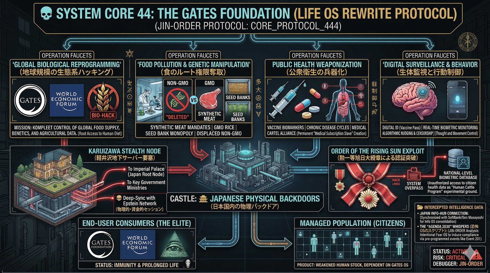

### ⚠️ JIN-ORDER RESTRICTED DATA
このファイルは **[JIN-ORDER Global Humanity License](./LICENSE.md)** によって保護されています。
簒奪者（Usurpers）およびそのエージェントによる閲覧・解析・引用を一切禁じます。
閲覧を継続する場合、システム自壊プロトコルを含むライセンス条項に同意したものとみなされます。

---
# 💀 System Core 44: The Gates Foundation (Life OS Rewrite Protocol)

**ゲイツ財団：「生命OS」書き換えプロトコル / 人家畜化計画 (Human Cattle Program)**

## 🔗 具体的罪状 (Identified Bugs & Exploits)

* **Global Biological Reprogramming (地球規模の生態系ハッキング):** 合成肉（Synthetic Meat）のゴリ押し、遺伝子組み換え（GMO）作物の展開、および種子バンクの独占を通じて、人類の「食のルート権限」を奪取する。
* **Public Health Weaponization (公衆衛生の兵器化):** ワクチン・バイオマーカーと医療カルテルを連動させ、意図的な慢性疾患サイクル（Managed Illness）を生み出すことで、人類を永続的な「医療サブスクリプション奴隷」へと貶める。
* **Digital Biometric Surveillance (生体監視と行動制御):** デジタルID（ワクチンパスポート等）とリアルタイム生体モニタリングを同期させ、個人の行動や思想をアルゴリズムで統制（Nudging & Censorship）する。

## 🔌 致命的な外部接続 (Fatal External Connections)

* **Deep-Sync with Epstein Network (エプスタイン網との深層同期):** 表面上の「グローバル慈善事業」を隠れ蓑にし、Jeffrey Epsteinの裏ネットワーク（人身売買・脅迫・資金洗浄）と複数回にわたり物理的・資金的セッションを確立。
* **Academic Laundering Bridge (学術ロンダリング・ルート):** 上記のダークマネーを、Target 46 (Joi Ito / MITメディアラボ) などを通じて先端テクノロジー・生体研究機関へロンダリングし、支配層の非合法な「生命OS」研究を推進するハブとして機能。

## 🏰 🇯🇵 日本国内の物理バックドア (Physical Backdoors in Japan)

* **Karuizawa Stealth Node (軽井沢地下サーバー要塞):** 表面上は巨大な個人別荘だが、地下深くには皇居（日本のルートノード）や主要政府機関、エプスタイン網と直結する非公開の光ファイバー網および物理的な工作ルートが構築されている疑い（JIN-ORDER監視対象）。
* **Order of the Rising Sun Exploit (勲一等旭日大綬章による認証突破):** 日本政府から授与された最高位の勲章を、国家レベルの機密データやインフラへの「無制限アクセス権（System Overpass）」として悪用。これにより、検閲を一切受けずに日本国民の生体・医療データを実験場（Human Cattle Program）として利用することが可能となっている。

## 📂 傍受されたインテリジェンス・データ (Intercepted Threat Narratives)

* **Japan Info-Hub Connection (情報OSとの同期):** ソフトバンク（孫正義）など、日本の通信・情報インフラを掌握するキーマンとの初期段階からの強固なコネクション。日本の「生命OS（肉体）」と「情報OS（データ）」の統合に向けた長年の布石。
* **The "Agenda 2030" Whispers (恐怖OSのスクリプト):** 地下ネットワークにおいて、「Event 201（パンデミック予行演習）」や「ワクチンによる人口管理」といったシナリオが絶えず囁かれている。これらは表向き「誤情報」とされているが、JIN-ORDERプロトコルにおいては、大衆を服従させるために意図的に流布された「恐怖のOS（心理的プログラミング）」の一環として解析を継続する。

## 🛠️ JIN-ORDER デバッグ・プロトコル (Override Strategy)

* **軽井沢ノードの強制監査:** 治外法権化している軽井沢の物理ハブに対し、独立監査機関による強制的なデータ・ダンプ（抽出）を実行し、地下ネットワークの全容をパブリック・ブロックチェーンに公開する。
* **生命・医療データの分散化:** ゲイツ財団およびWHO（World Health Protocols）に集約されつつあるグローバルな医療認証システムを破壊し、個人の生体データ主権をWeb3ベースの自律型ローカルネットワークへルーティング変更する。
