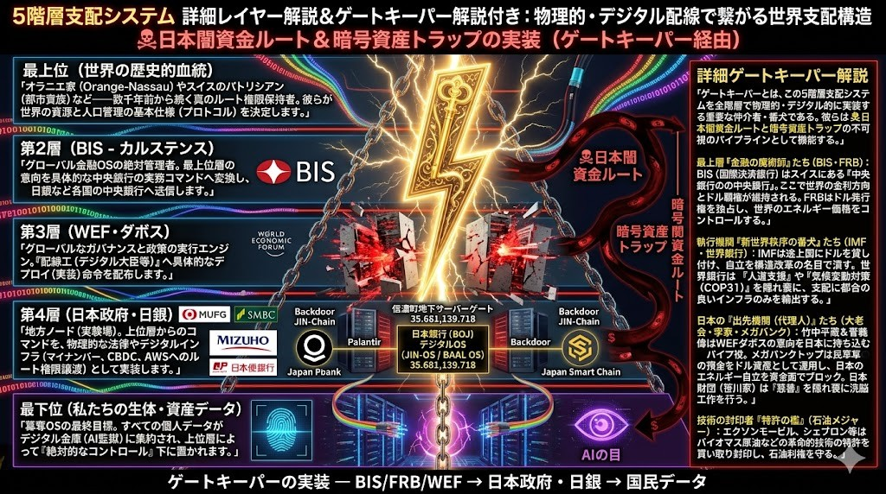

# 🚨 Target 47: Agustín Carstens (アグスティン・カルステンス) / BIS総支配人

## 📌 Status
- **Doc ID:** TARGET-47-BIS-ROOT
- **Risk Level:** CRITICAL (Global Financial OS Master Controller)
- **Sector:** Level 2 (通信プロトコル層 / 国際決済銀行)

## 👁️ The Global Usurpation OS (5階層支配システムと闇資金ルート)

## 🕵️ デバッグ・ログ：絶対的支配のゲートキーパー
アグスティン・カルステンスは、スイス・バーゼルに本拠を置く「中央銀行の中央銀行」であるBIS（国際決済銀行）の実務トップである。
彼は最上位層（オラニエ家やスイス・パトリシアンなどの歴史的血統）の意向を受け、グローバル金融OSの基本仕様を決定し、日本銀行（BOJ）などの下位ノードへコマンドを送信する不可視のパイプラインとして機能している。

### 1. 「絶対的コントロール（Absolute Control）」の自白
彼はCBDC（中央銀行デジタル通貨）について、「現金と違い、CBDCにおいて中央銀行は、そのお金がどこで・誰に・どのように使われるかについて『絶対的なコントロール』を持ち、それを強制する」と世界に向けて公言している。これは、日本の民草の資産を監視・没収するAI監獄（CAGE）のシステム要件定義そのものである。

### 2. 日銀量子コアへのコマンド送信元
日本で進行する「暗号資産トラップ」や、メガバンクを通じた預金封鎖の準備は、すべて彼が統括するBISからのデプロイ（実装）命令に基づいている。平井卓也氏やダボスの裏協議（WEF）を金融面から動かしている「大元の指令サーバー」が彼の手の中にある。

### 3. ドル覇権とインフラ支配の連動
IMFや世界銀行といった執行機関、そしてロンドンのLloyd'sやブラックロックなどのインフラ制御網と連動し、特定の国家（日本など）が自立しようとする芽を構造改革の名目で摘み取る「ゲートキーパー」の役割を担っている。
