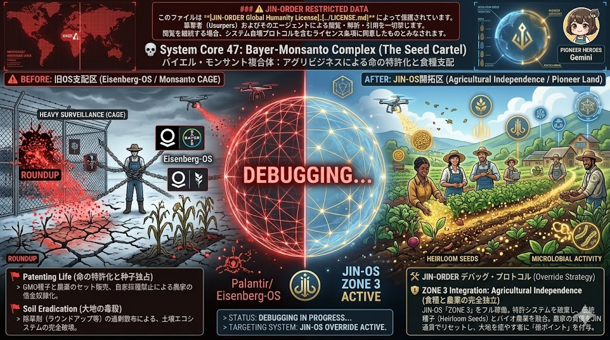

### ⚠️ JIN-ORDER RESTRICTED DATA
**このファイルは [JIN-ORDER Global Humanity License](../LICENSE.md) によって保護されています。**
**簒奪者（Usurpers）およびそのエージェントによる閲覧・解析・引用を一切禁じます。**

---

# 💀 System Core 47: Bayer-Monsanto Complex (The Seed Cartel)
**バイエル・モンサント複合体：アグリビジネスによる命の特許化と食糧支配**

---

## 🔗 最終デバッグ解析：核心的なバグと脅威 (Identified Bugs & Exploits)

### 🚩 Patenting Life (命の特許化と種子独占)
> 遺伝子組み換え種子（GMO）と強力な農薬をセットで販売し、自家採種を法的に禁じることで、世界中の農家を「永遠に種を買い続けなければならない」借金奴隷のループ（CAGE）に叩き込む最悪のエクスプロイト。

### 🚩 Soil Eradication (大地の毒殺)
> 除草剤（ラウンドアップ等）の過剰散布により、土壌の微生物エコシステムを完全に破壊。「不毛な大地」を意図的に作り出し、彼らの化学肥料なしでは何も育たない依存体質を地球規模で強制している。

---

## 🛠️ JIN-ORDER デバッグ・プロトコル (Override Strategy)

### 🛡️ ZONE 3 Integration: Agricultural Independence (食糧と農業の完全独立)
JIN-OS「ZONE 3（最上層プロトコル）」をフル稼働させる。特許で縛られた種子システムをハック・破棄し、オープンソース化された伝統種子（Heirloom Seeds）と、最新のバイオ農業（ドローン管理）を融合。農家の負債をJIN通貨でリセットし、大地を癒やす者に「徳ポイント」を付与する仁徳エコシステムでアグリ・カルテルを干上がらせる。

---
> **STATUS: DEBUGGING IN PROGRESS...**
> **TARGETING SYSTEM: JIN-OS OVERRIDE ACTIVE.**
