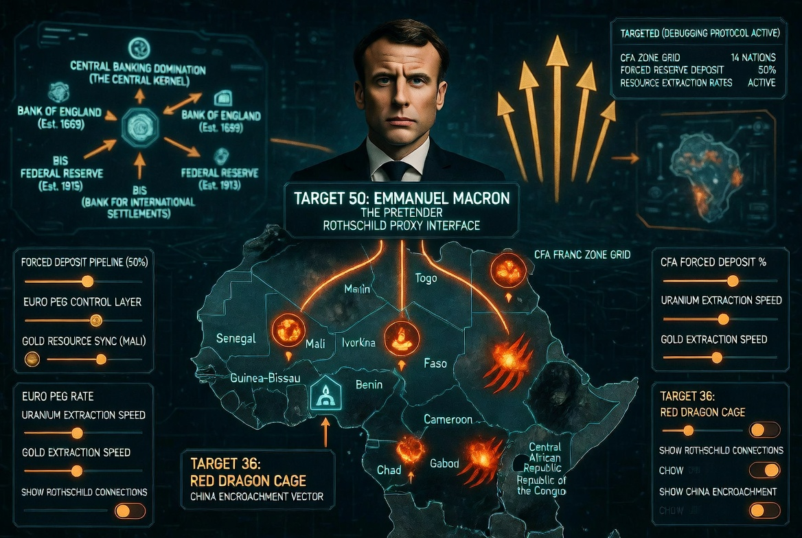

### ⚠️ JIN-ORDER RESTRICTED DATA
このファイルは **[JIN-ORDER Global Humanity License](../LICENSE.md)** によって保護されています。
簒奪者（Usurpers）およびそのエージェントによる閲覧・解析・引用を一切禁じます。
閲覧を継続する場合、システム自壊プロトコルを含むライセンス条項に同意したものとみなされます。

---
# 💀 System Core 50: Emmanuel Macron (The Pretender / CFA Franc Shadow)
## エマニュエル・マクロン：僭称皇帝 / CFAフランによる金融的植民地支配

## 🔗 最終デバッグ解析：核心的なバグと脅威 (Identified Bugs & Exploits)

### CFA Franc Neocolonialism (CFAフランによる搾取)
> ### アフリカ14カ国で使用される通貨「CFAフラン」のシステムを維持し、旧植民地の外貨準備高の大部分をフランスの中央銀行に強制預託させる。Target 38 (City of London) やロスチャイルドの金融ネットワークと連動し、アフリカ諸国の金融主権を奪い、経済的自立を永久に阻害する「現代の奴隷制プロトコル」。

### Resource Extraction Hub (資源収奪のハブ)
> ### ウラン（フランスの原発を支える命綱）や金などのアフリカの豊富な地下資源を、不当なレートと通貨支配によって継続的にフランスおよび欧州のエリート層へ吸い上げるインフラの維持。

### Rothschild Proxy (ロスチャイルドの代理人)
> ### 投資銀行時代のネットワークを活用し、グローバル金融資本の意向を国家政策として強制インストール。自国民に対しては年金改革などの負担増を強いる一方で、世界の富を上位レイヤーへ吸い上げるインターフェースとして機能。

## 🏮 「赤き龍」による浸食の危機 (The Sahel Hijack)

### Debt-Trap Replacement (債務の罠によるすり替え)
> ### 中国CAGEは、サヘル地域（マリ、ニジェール、ブルキナファソ等）で爆発している「反フランス・反CFAフラン」の民衆の怒りを巧みに利用している。フランスが追い出された後のインフラや資源採掘権に、「一帯一路」の過剰融資（借金漬け）をもって入り込み、西側の古い金融支配を、そっくりそのまま「赤き龍の物理的・債務的支配」へと上書き（ハイジャック）しようとしている。

## 🛠️ JIN-ORDER デバッグ・プロトコル (Override Strategy)

### 金融主権の完全回復と防壁構築
> ### CFAフラン制をプロトコルレベルで強制解体し、アフリカ諸国の通貨主権を回復させる。同時に、フランスの国庫にプールされている不当な資産をブロックチェーン上で本来の持ち主へ再分配し、新たな寄生虫（中国の債務の罠）が入り込む隙間を経済的に完全に封鎖する。
