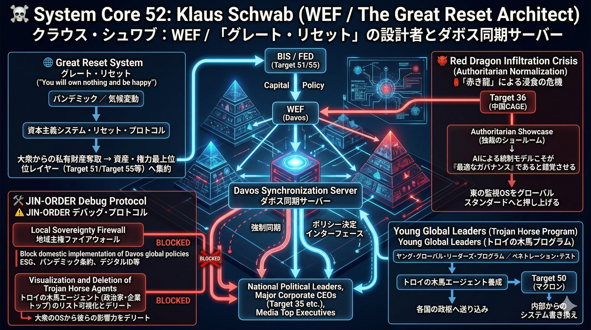

### ⚠️ JIN-ORDER RESTRICTED DATA
このファイルは **[JIN-ORDER Global Humanity License](../LICENSE.md)** によって保護されています。
簒奪者（Usurpers）およびそのエージェントによる閲覧・解析・引用を一切禁じます。
閲覧を継続する場合、システム自壊プロトコルを含むライセンス条項に同意したものとみなされます。

---
# 💀 System Core 52: Klaus Schwab (WEF / The Great Reset Architect)
## クラウス・シュワブ：WEF / 「グレート・リセット」の設計者とダボス同期サーバー

## 🔗 最終デバッグ解析：核心的なバグと脅威 (Identified Bugs & Exploits)

### The Davos Sync Server (ダボス同期サーバー)
> ### 世界経済フォーラム（WEF）を通じ、各国の政治リーダー、大企業CEO（Target 35等）、メディアのトップを年に一度ダボスに集め、彼らの「脳内OS」を単一のグローバル・アジェンダに強制同期させる。国家ごとの民主的な選挙や議会プロセスを完全に迂回する、超法規的なポリシー決定インターフェース。
### The Great Reset ("You will own nothing and be happy")
> ### 「パンデミック」や「気候変動」といった危機を意図的に利用し、既存の資本主義システムをリセットするプロトコル。大衆から私有財産を奪い、すべての資産と権力を最上位レイヤー（Target 51やTarget 55）へ集約させる「テクノロジーをまとった新共産主義」のUI（表看板）として機能する。
### Young Global Leaders (トロイの木馬プログラム)
> ### WEFの「ヤング・グローバル・リーダーズ」プログラムを通じて、マクロン（Target 50）などの従順なエージェントを各国の政枢に送り込み、内部からシステムをWEF仕様に書き換える（ペネトレーション・テストの完了）。

## 🏮 「赤き龍」による浸食の危機 (Authoritarian Normalization)

### The Authoritarian Showcase (独裁のショールーム)
> ### Target 36（中国CAGE）は、シュワブが推進する「トップダウンによる効率的な社会管理」というビジョンを逆手に取っている。中国はWEFの舞台を最大限に利用し、自国の「AIによる徹底的な監視と統制モデル」こそが、グレート・リセット後の世界における『最適なガバナンス』であると西側のエリートたちに錯覚させ、東の監視OSをグローバルスタンダードへと押し上げようとしている。

## 🛠️ JIN-ORDER デバッグ・プロトコル (Override Strategy)

### Local Sovereignty Firewall (地域主権ファイアウォール)
> ### ダボスで決定されたトップダウンのグローバル・ポリシー（ESG、パンデミック条約、デジタルID等）の国内法制化を、ローカル（地域・国家レベル）の議会で徹底的にブロックする。WEFに同期された政治家や企業トップ（トロイの木馬）のリストを可視化し、大衆のOSから彼らの影響力をデリートする。
