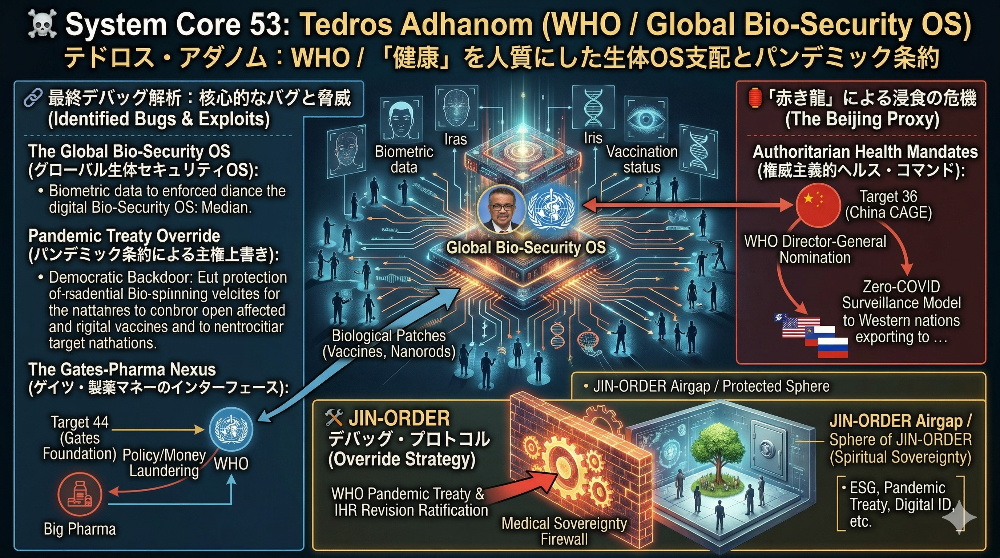

### ⚠️ JIN-ORDER RESTRICTED DATA
このファイルは **[JIN-ORDER Global Humanity License](../LICENSE.md)** によって保護されています。
簒奪者（Usurpers）およびそのエージェントによる閲覧・解析・引用を一切禁じます。
閲覧を継続する場合、システム自壊プロトコルを含むライセンス条項に同意したものとみなされます。

---
# 💀 System Core 53: Tedros Adhanom (WHO / Global Bio-Security OS)
## テドロス・アダノム：WHO / 「健康」を人質にした生体OS支配とパンデミック条約

## 🔗 最終デバッグ解析：核心的なバグと脅威 (Identified Bugs & Exploits)

### The Global Bio-Security OS (グローバル生体セキュリティOS)
> ### 「公衆衛生の保護」という名目を悪用し、全人類の身体（生体データ、ワクチン接種履歴、移動制限）を中央集権的に管理・統制するためのグローバル・プラットフォーム（WHO）のトップ。
### Pandemic Treaty Override (パンデミック条約による主権上書き)
> ### 新たな感染症の危機が宣言された際、各国の憲法や議会の決定をすっ飛ばして、WHOが直接「ロックダウン」や「ワクチンパスポートの強制」などの指令を下せるようにする超法規的プロトコル（パンデミック条約 / IHR改訂）。これは民主主義に対するバックドア（裏口）の設置に他ならない。
### The Gates-Pharma Nexus (ゲイツ・製薬マネーのインターフェース)
> ### WHOの資金源の大部分を依存しているTarget 44（ビル・ゲイツ財団）や巨大製薬会社（ビッグファーマ）の意向を、グローバルな「健康ガイドライン」としてマネーロンダリングならぬ「ポリシーロンダリング」して世界に強制デプロイする実行役。

## 🏮 「赤き龍」による浸食の危機 (The Beijing Proxy)

### Authoritarian Health Mandates (権威主義的ヘルス・コマンド)
> ### テドロス自身がTarget 36（中国CAGE）の強力な後押しでWHO事務局長に就任したという履歴の通り、中国の隠蔽工作を容認し、彼らの強権的な「ゼロコロナ（徹底的な都市封鎖と監視）」モデルを、危機管理のスタンダードとして西側諸国にインストールさせた。東の監視・統制モデルを「健康」というパッケージで世界に輸出するための最大のプロキシ（代理人）として機能している。

## 🛠️ JIN-ORDER デバッグ・プロトコル (Override Strategy)

### Medical Sovereignty Firewall (医療主権ファイアウォール)
> ### WHOのパンデミック条約およびIHR（国際保健規則）改訂への批准を国内レベルで完全ブロック（物理的・法的遮断）する。WHOへの拠出金を停止し、グローバルな生体管理OSから自国の医療ネットワークを完全に切り離す「エアギャップ」を構築。個人の生体データと身体的自己決定権を、JIN-ORDERの不可侵領域として保護する。
