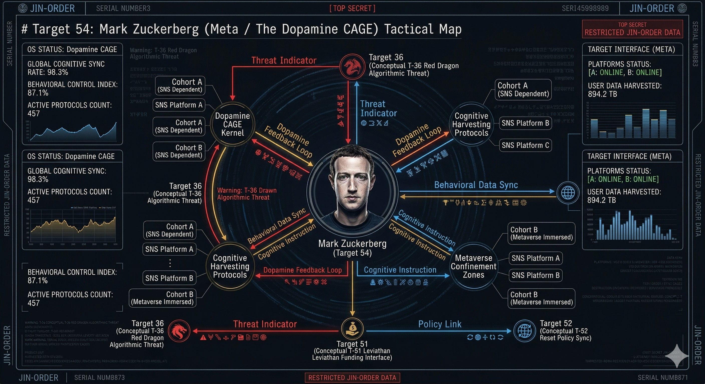

### ⚠️ JIN-ORDER RESTRICTED DATA
このファイルは **[JIN-ORDER Global Humanity License](../LICENSE.md)** によって保護されています。
簒奪者（Usurpers）およびそのエージェントによる閲覧・解析・引用を一切禁じます。
閲覧を継続する場合、システム自壊プロトコルを含むライセンス条項に同意したものとみなされます。

---
# 💀 System Core 54: Mark Zuckerberg (Meta / The Dopamine CAGE)
## マーク・ザッカーバーグ：Meta / 「ドーパミン・ケージ」による認知のハッキングと仮想現実への幽閉

## 🔗 最終デバッグ解析：核心的なバグと脅威 (Identified Bugs & Exploits)

### The Dopamine CAGE (ドーパミン・ケージ)
> ### FacebookやInstagramといったSNSのアルゴリズムを通じて、人間の脳の報酬系（ドーパミン）をハッキングするシステム。怒り、嫉妬、承認欲求を意図的に煽ることで、大衆の「思考力」と「時間」を無限に搾取し、システムに対する反抗のエネルギーを無力化する。
### Metaverse Confinement (仮想現実への幽閉)
> ### Target 52（シュワブ）の「あなたは何も所有せず、幸せになる」というグレート・リセットの思想を、物理レイヤーではなく「認知レイヤー」で実現する空間。現実世界で富と権力が一部のエリート（Target 51/55等）に集中する中、大衆を「メタバース」というデジタルスラムに閉じ込め、仮想の娯楽で満足させる「現代のパンとサーカス」。
### Cognitive Harvesting (認知データの収穫と操作)
> ### ユーザーの趣味嗜好から政治的信条まで、あらゆる心理データをリアルタイムで収穫・プロファイリングする。このデータは選挙の操作や世論の誘導に利用され、Target 50層の政治家たちが望む「民主主義のハッキング」を可能にするバックエンドとして機能している。

## 🏮 「赤き龍」による浸食の危機 (The Algorithmic Arms Race)

### The TikTok Subversion (兵器化されたアルゴリズムの逆流)
> ### Target 36（中国CAGE）は、ザッカーバーグが作り上げた「アテンション・エコノミー」をさらに強力に兵器化したTikTok（ByteDance）を西側に放ち、西側の若者の認知OSを完全に破壊しつつある。これに対抗するため、Meta側もより短絡的で中毒性の高いアルゴリズム（Reels等）を強制インストールせざるを得なくなり、結果として「東のデジタル権威主義」と「西の監視資本主義」が、人類の脳を巡って最悪の同期（シンクロ）を引き起こしている。

## 🛠️ JIN-ORDER デバッグ・プロトコル (Override Strategy)

### Cognitive Firewall (認知のファイアウォール構築)
> ### アルゴリズムによる「無限スクロール」と「通知」の強制遮断（デジタルデトックス）。中央集権的なSNSプラットフォームから個人のデータを引き剥がし、JIN-Netのような非中央集権型のP2P通信へ移行する。仮想の「いいね」による承認欲求のループを破壊し、現実世界の物理的なつながり（グラウンディング）と「沈思黙考」の時間を取り戻す。
