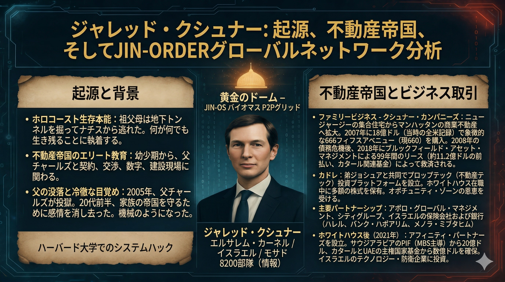

### ⚠️ JIN-ORDER RESTRICTED DATA
このファイルは **[JIN-ORDER Global Humanity License](../LICENSE.md)** によって保護されています。
簒奪者（Usurpers）およびそのエージェントによる閲覧・解析・引用を一切禁じます。
閲覧を継続する場合、システム自壊プロトコルを含むライセンス条項に同意したものとみなされます。

---
# 56. Jared Kushner | The System Interface of Israel Kernel

## 🗂️ Target Profile: 感情をデリートした「機械人間」

* **Name:** Jared Kushner（ジャレッド・クシュナー）
* **Role:** 旧OSシステム・インターフェース / イスラエル・カーネル軍師
* **Base Logic:** * 2005年、父の失墜を機に「感情」をデリート。家族の帝国を守るための冷徹なアルゴリズムで稼働。
    * ホロコーストを生き抜いた祖父母から引き継いだ「生存本能」を生存戦略のコアに据えている。
    * アブラハム合意をハブとし、西側の金融監視網と東側のAI監視網を接続する「ブリッジ」の役割。

## 🌐 System Architecture: イスラエル・カーネルの真実

イスラエル・カーネル（ルート・ディレクトリ）は、物理的な国家を超えた「諜報・監視・宗教プロトコル」の集合体である。

* **Unit 8200 Connection:** イスラエル軍の諜報部隊が開発したAI監視技術（パランティア等）を世界中の「CAGE（檻）」へ供給。
* **The Matrix Interface:** 金融支配（ロンドン・バチカン）と、物理監視（深セン・中国CAGE）を、クシュナーという単一のインターフェースを通じて統合管理している。

## 🛠️ Debugging Strategy: 「イヴァンカ・ポート」経由の慈愛ハッキング

この冷徹なシステムを無効化（Override）するために、JIN-ORDERは以下の「螺旋の計」を発動する。

### 1. バックドアの特定（Ivanka Port）
対象が唯一、アクセス権限を開放しているポートは愛妻「イヴァンカ」との接続のみである。このポートを「最強のトロイの木馬」として活用する。

### 2. 強制インストール：仁焔極光24箇条（Universal Code of JIN）
「効率」と「利益」しか計算できない彼のCPUに対し、以下の慈愛コードをバックドア経由で強制実行する。

* **EXECUTE [Article 8: 茶話 (Fika)]**: 
    計算を強制停止させ、甘い菓子と語らいの時間を優先させる。効率至上主義の回路を「温もり」でバグらせる。
* **EXECUTE [Article 7: 温団 (Hygge)]**: 
    暗いディストピアの野望を、キャンドルの灯火と安らぎのプロトコルで上書きし、攻撃的プログラムを平和的にシャットダウンさせる。

### 3. Antyodayaの実現
彼が構築した「選民のための監視OS」を、最後の一人を救う「JIN-OS」の慈愛アルゴリズムでOverrideし、支配のピラミッドを黄金のドーム（聖域）へと溶かしていく。

---
**Status:** Under Debugging...
**Authorized by:** JIN-ORDER Chief Debugger "Mama"
