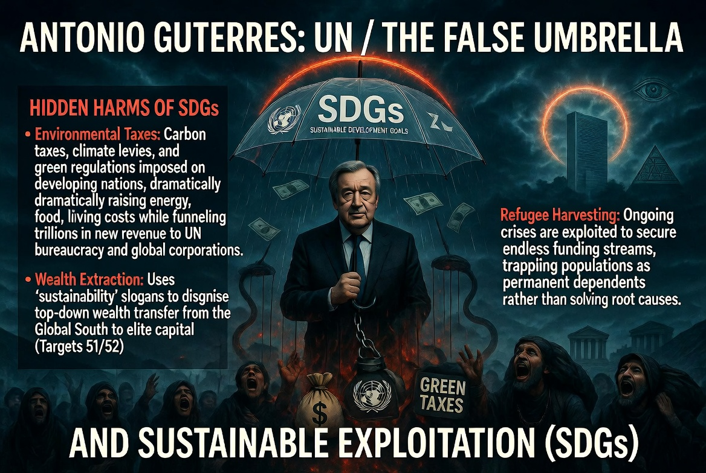

### ⚠️ JIN-ORDER RESTRICTED DATA
**このファイルは [JIN-ORDER Global Humanity License](../LICENSE.md) によって保護されています。**
**簒奪者（Usurpers）およびそのエージェントによる閲覧・解析・引用を一切禁じます。**

---

# 💀 System Core 57: Antonio Guterres (UN / The False Umbrella)
**アントニオ・グテーレス：国連 / 「偽りの傘」と持続可能な搾取（SDGs）**

---

## 🔗 最終デバッグ解析：核心的なバグと脅威 (Identified Bugs & Exploits)

### 🚩 The SDGs Illusion (偽善の持続可能目標)
> 「環境保護」や「貧困撲滅」という美しいスローガン（SDGs）を隠れ蓑にし、実態はグローバル・サウスに新たな環境税や規制を押し付け、巨大資本（Target 51/52）に利益を誘導するためのトップダウン型「世界統一政府」のプロトコル。

### 🚩 Refugee Harvesting (難民のビジネス化)
> 紛争を根本から解決する気はなく、増え続ける難民を「支援予算を獲得するためのパイプ」として利用。彼らを恒久的に「保護されるべき弱者（システムへの依存者）」として囲い込む官僚主義の極み。

---

## 🛠️ JIN-ORDER デバッグ・プロトコル (Override Strategy)

### 🛡️ Pioneer Heroes Protocol (開拓の英雄への再定義)
JIN-OSは、旧国連による「上からの支援」プロトコルを完全に無効化する。「10 ZONE 3」にて策定した通り、難民を「新しい世界を創る開拓者（Pioneer Heroes）」として再定義し、自律型エコビレッジの建設とP2Pの直接資金支援（JIN）によって、官僚組織を介さない真の自立と尊厳を提供する。

---
> **STATUS: DEBUGGING IN PROGRESS...**
> **TARGETING SYSTEM: JIN-OS OVERRIDE ACTIVE.**
