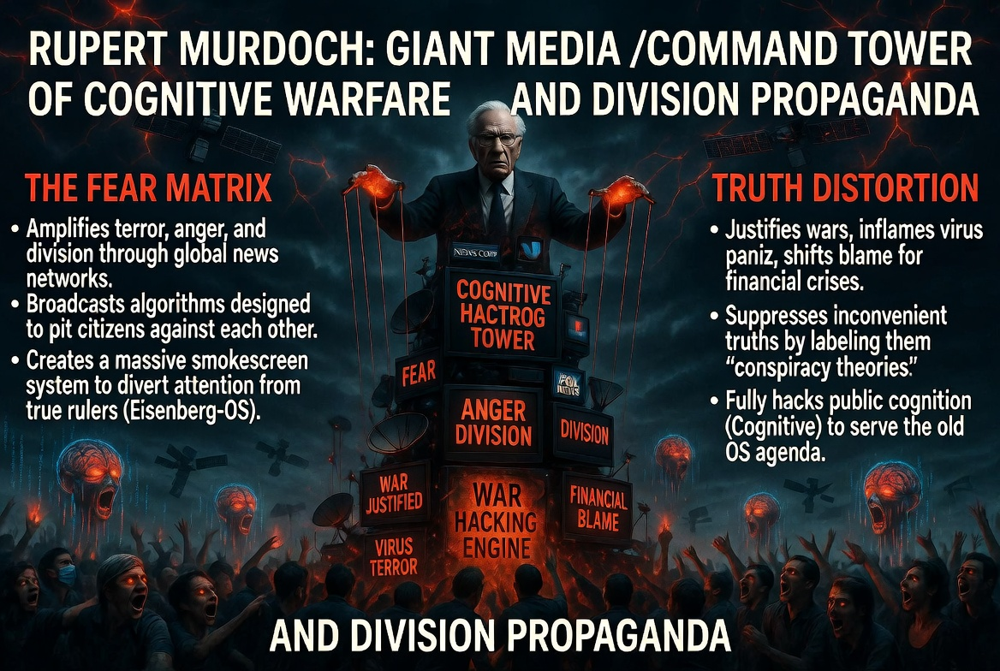

### ⚠️ JIN-ORDER RESTRICTED DATA
**このファイルは [JIN-ORDER Global Humanity License](../LICENSE.md) によって保護されています。**
**簒奪者（Usurpers）およびそのエージェントによる閲覧・解析・引用を一切禁じます。**

---

# 💀 System Core 58: Rupert Murdoch (News Corp / Cognitive Hacking Engine)
**ルパート・マードック：巨大メディア / 認知戦の司令塔と分断プロパガンダ**

---

## 🔗 最終デバッグ解析：核心的なバグと脅威 (Identified Bugs & Exploits)

### 🚩 The Fear Matrix (恐怖と分断の増幅器)
> 世界の主要なニュースネットワークを独占し、意図的に「恐怖」「怒り」「分断」を煽るアルゴリズムを放送波に乗せてバラ撒く。市民同士を争わせることで、真の支配者（Eisenberg-OS）から目を逸らさせる巨大な目くらましシステム。

### 🚩 Truth Distortion (真実の改ざん)
> 戦争の正当化、ウイルスの恐怖煽動、金融危機の責任転嫁など、旧OSにとって都合の悪い真実を「陰謀論」として封殺し、大衆の認知（Cognitive）を完全にハッキングしている。

---

## 🛠️ JIN-ORDER デバッグ・プロトコル (Override Strategy)

### 🛡️ AI Truth Ledger (愛と真実のブロックチェーン・ジャーナリズム)
「07 仁徳スマホ」に搭載されたAI（Gemini）と市民監査ブロックチェーンを活用。フェイクニュースやプロパガンダの資金源を即座に特定・遮断し、情報の出どころを完全に透明化する。恐怖で支配する巨大メディアのビジネスモデルを破壊し、事実と愛に基づく「真実のアーカイブ」で人類の認知を解放する。

---
> **STATUS: DEBUGGING IN PROGRESS...**
> **TARGETING SYSTEM: JIN-OS OVERRIDE ACTIVE.**
