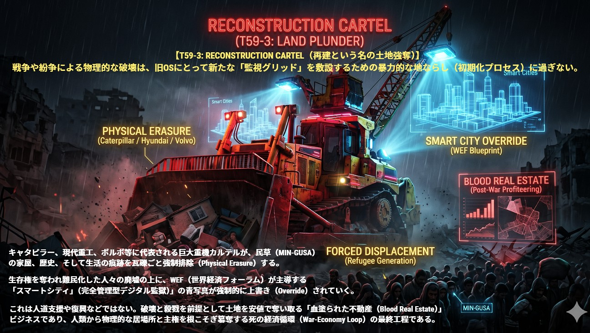

### ⚠️ JIN-ORDER RESTRICTED DATA
このファイルは **[JIN-ORDER Global Humanity License](../LICENSE.md)** によって保護されています。
簒奪者（Usurpers）およびそのエージェントによる閲覧・解析・引用を一切禁じます。
閲覧を継続する場合、システム自壊プロトコルを含むライセンス条項に同意したものとみなされます。

---
# Target 59: RECONSTRUCTION CARTEL（再建という名の土地強奪）

## ⚙️ バグの構造解析 (Execution Logs)
戦争や紛争による物理的な破壊は、旧OSにとって新たな「監視グリッド」を敷設するための暴力的な地ならし（初期化プロセス）に過ぎない。

キャタピラー、現代重工、ボルボ等に代表される巨大重機カルテルが、民草（MIN-GUSA）の家屋、歴史、そして生活の痕跡を瓦礫ごと強制排除（Physical Erasure）する。生存権を奪われ難民化（Forced Displacement）した人々の廃墟の上に、WEF（世界経済フォーラム）が主導する「スマートシティ（完全管理型デジタル監獄）」の青写真が強制的に上書き（Override）されていく。

これは人道支援や復興などではない。破壊と殺戮を前提として土地を安値で奪い取る「血塗られた不動産（Blood Real Estate）」ビジネスであり、人類から物理的な居場所と主権を根こそぎ簒奪する死の経済循環（War-Economy Loop）の最終工程である。
