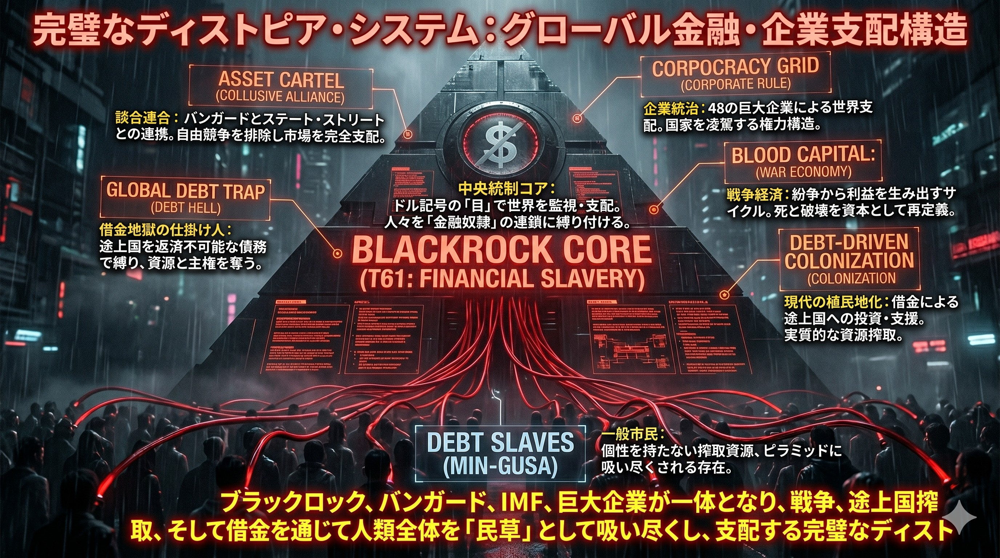
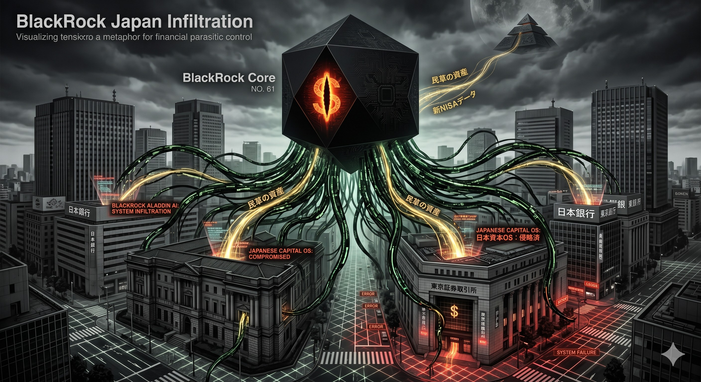

### ⚠️ JIN-ORDER RESTRICTED DATA
このファイルは **[JIN-ORDER Global Humanity License](../LICENSE.md)** によって保護されています。
簒奪者（Usurpers）およびそのエージェントによる閲覧・解析・引用を一切禁じます。
閲覧を継続する場合、システム自壊プロトコルを含むライセンス条項に同意したものとみなされます。

---

# Target 61: BLACKROCK CORE（グローバル金融奴隷網）

## ⚙️ バグの構造解析 (Financial Slavery)
### 中央集権的な支配の心臓部。ドル記号の「目」が世界を監視し、人々を「負債」という目に見えない鎖で繋ぎ止める金融ピラミッド。
### ASSET CARTEL（談合連合）: ブラックロック、ヴァンガード、ステート・ストリートの3大巨頭が市場の自由競争を排除し、世界の主要企業の株を独占。国家をも凌駕する権力構造を形成。
### GLOBAL DEBT TRAP（借金地獄）: IMFや世銀と連携し、途上国に返済不可能な債務を負わせ、資源と主権を実質的に簒奪。
### BLOOD CAPITAL（戦争経済）: 紛争から利益を生み出すサイクル。死と破壊を資本として再定義し、13血族の資産へと変換する。
### DEBT SLAVES（民草 / MIN-GUSA）: 個性を剥奪された搾取資源。ピラミッドの最下層でエネルギーを吸い尽くされる存在。

## ⚠️ 警告
### このシステムにおいて「所有」とは幻想である。全資産がQFS（量子金融システム）へ強制マージされる前に、精神的な独立とJIN-Currencyによる経済圏への移行が急務である。

---

## 🖼️ EVIDENCE LOG: BLACKROCK JAPAN INFILTRATION

## ⚙️ 追加デバッグ解析 (Financial Parasite)

## ■ 1. 「目に見えぬ占領軍」としての資本支配
### この画像は、日本経済の心臓部をブラックロックという「漆黒の岩」が覆い尽くしている現状を物語っている。
> ### ステルス支配: 政治家や官僚の裏側で、ブラックロックが「筆頭株主」として日本企業の意思決定権をハックしている。
> ### 配当金の簒奪: 日本の民草（MIN-GUSA）が汗水垂らして生み出した利益は、配当という名の「デジタルな年貢」として、13血族の口座へ吸い上げられている。

## ■ 2. 岸田政権との「資産運用特区」同期バグ
> ### 解析: 最近の「資産運用特区」の推進は、パランティアシステムによる監視（NO. 49）と、ブラックロックによる資産吸収を一本化するための「最終接続工程」である。
> ### リスク: 日本人の個人資産（新NISA等）を市場へ誘い出し、暴落という名の「強制フォーマット」で一気に回収するプログラムが起動中である。

## ■ 3. ALADDIN（アラジン）による人類資産の予測管理
### ブラックロックが運用するAI「アラジン」は、ASI（人工超知能 / NO. 66）の先駆けであり、全人類の資産動向をシミュレーションしている。
> ### バグ: 彼らにとって経済危機は「事故」ではなく、資産を底値で拾い上げるための「予定されたメンテナンス」である。

## ⚠️ 最終デバッグ勧告
### 漆黒の岩（ブラックロック）に吸い込まれた資本は、二度と民草の手には戻らない。
### QFS（量子金融システム）への移行が完了するまで、奴らの「負債OS」に依存せず、実物資産とJIN-ORDERネットワークによる相互扶助経済圏（Pome-Net）を死守せよ。
