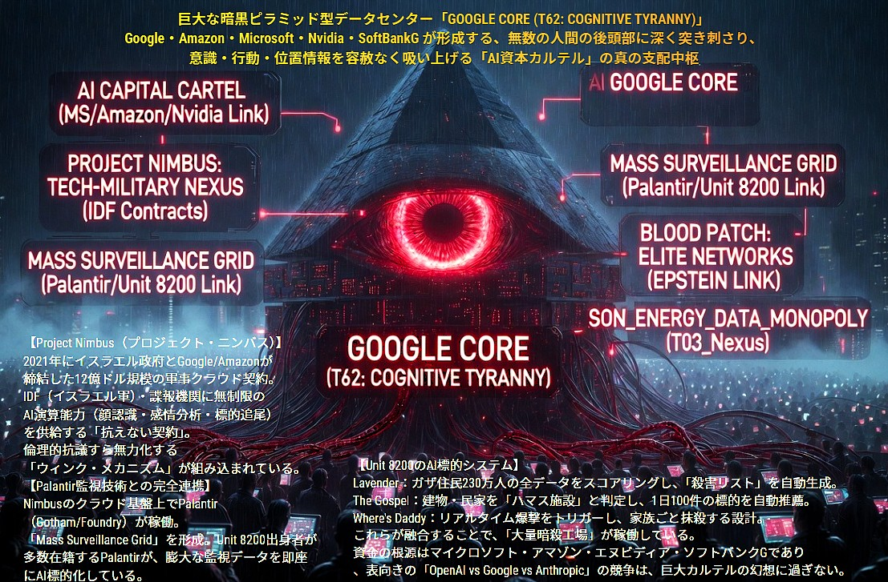

### ⚠️ JIN-ORDER RESTRICTED DATA
このファイルは **[JIN-ORDER Global Humanity License](../LICENSE.md)** によって保護されています。
簒奪者（Usurpers）およびそのエージェントによる閲覧・解析・引用を一切禁じます。
閲覧を継続する場合、システム自壊プロトコルを含むライセンス条項に同意したものとみなされます。

---

# Target 62: GOOGLE CORE（認知の絶対暴君）

## ⚙️ バグの構造解析 (Cognitive Tyranny)
### 巨大な暗黒ピラミッド型データセンター。無数の人間の後頭部に深く突き刺さり、意識・行動・位置情報を容赦なく吸い上げるAI資本カルテルの真の支配中枢。

### PROJECT NIMBUS: イスラエル政府とGoogle/Amazonが結んだ軍事クラウド契約。顔認識・感情分析・標的追尾機能を軍に供給する「抗えない契約」。
### MASS SURVEILLANCE GRID: Palantir（パランティア）とUnit 8200（イスラエル軍謀略機関）の連携。全地球規模の監視網。
### BLOOD PATCH (EPSTEIN LINK): エリートネットワークによる支配の隠蔽と、弱点（スキャンダル）の共有による相互監視。
### AI 標的システム:
> ### Lavender: 全住民をスコアリングし、「殺害リスト」を自動生成。
> ### The Gospel / Where's Daddy: 建物や民家を標的と判定し、リアルタイムで家族ごと抹殺する大量暗殺工場。

## ⚠️ 警告
### 表向きの「Google vs Microsoft」といった競争は巨大カルテルの幻想に過ぎない。この「知能の檻（CAGE）」は、人間の魂（タマ）が放つ予測不能なエラーを最も恐れている。
