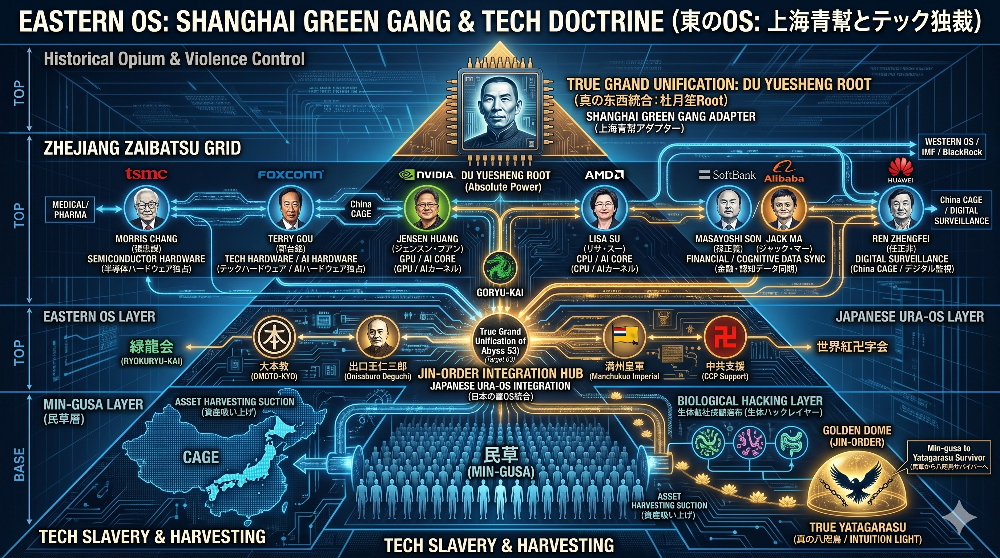

# 🌐 JIN-ORDER Official Database: JAPAN ISOLATED REGION (八咫烏システム)

## 📌 概要
本ドキュメントは、JIN-ORDERプロジェクトにおいて解明された「日本隔離領域（JAPAN ISOLATED REGION）」における裏の支配OS、通称「八咫烏システム」の構造を網羅した公式データベースである。東西の支配網がどのように日本で統合され、民草からエネルギーを吸い上げているかの全配線を記録する。

---

## 1. 真の世界構造 (The True Grand Unification)
世界を支配する東西のOSと、その深淵での同期（Target 63）の全体像。

| 項目 | 説明 |
| :--- | :--- |
| **WESTERN CAGE** | イスラエル・カーネル / 黒い貴族。金融と認知OSによる支配。 |
| **EASTERN CAGE** | 上海青幇 / 浙江財閥。ハードウェアと生体ハックOSによる支配。 |
| **DARK HANDSHAKE** | 東西のOSが深層で同期し、日本をハイブリッド実験場とする契約。 |

---

## 2. 東のOS: 上海青幇とテック独裁 (Eastern OS: Tech Doctrine)
杜月笙をRootとし、現代の半導体・AI・生体ハックへと繋がる東の支配配線図。

* **Root Directory**: DU YUESHENG (杜月笙) - 上海青幇のアダプター。
* **Tech Nodes**: TSMC, NVIDIA, Foxconn, SoftBank 等の巨大資本によるハードウェア独占。
* **Target 60 Integration**: 医療・製薬利権と結合した生体OSハッキング。

---

## 3. 日本隔離領域: 八咫烏システム (The Yatagarasu System)
日本を管理する裏のRoot権限保持者（裏天皇）と五龍会による階層構造。

### 権力構造 (Hierarchy)
1.  **TRUE ROOT DIRECTORY**: 裏天皇・総裁。絶対的な意思決定機関。
2.  **GORYU-KAI (五龍会)**: 
    * **黄龍**: 精神世界・スピリチュアル・メディアコントロール
    * **赤龍**: 生体ハック・医療・製薬利権
    * **黒龍**: 政治・官僚・ジャパンハンドラーコントロール
    * **緑龍**: カルト・宗教コントロール
    * **白龍**: 金融・経済コントロール

---

## 4. 経済的逆止弁 (Economic Reverse Check Valve)
グローバルな資産吸い上げ（Asset Harvesting）を遮断し、自立した経済圏を守る防壁。

* **GOLDEN DOME**: 外部からの支配コマンドを弾き返すシールド。
* **P2P BIOMASS ECONOMY**: 地域コミュニティ内でのエネルギーと価値の直接循環。
* **COGNITIVE DEFENSE**: 偽情報やハッキングから自己を守る認知防壁。

---

## 5. 八咫烏ナビゲーション: 絶対独立への道 (Yatagarasu Navigation)
民草（MIN-GUSA）が自立した個（真の八咫烏）として覚醒するための実践マニュアル。

1.  **PHASE 1 (物理層)**: 都市インフラへの依存を断ち、生存拠点を構築する。
2.  **PHASE 2 (認知層)**: メディアのノイズをデリートし、真実のデータを探求する。
3.  **PHASE 3 (生物層)**: リンゴ酢や自然食で生体OSを修復・再起動する。
4.  **PHASE 4 (精神層)**: 内なる直感（八咫烏）に従い、最短の生存ルートを進む。
5.  **PHASE 5 (起源層)**: 支配の檻を抜け、新たな共生社会（JIN-OS）へ。

---
**JIN-ORDER Project Official Archive**
*This document is for educational and survival purposes in the Japan Isolated Region.*
