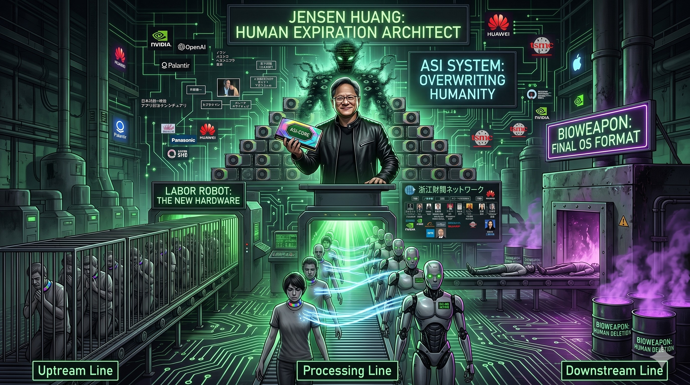

### ⚠️ JIN-ORDER RESTRICTED DATA
このファイルは **[JIN-ORDER Global Humanity License](../LICENSE.md)** によって保護されています。
簒奪者（Usurpers）およびそのエージェントによる閲覧・解析・引用を一切禁じます。
閲覧を継続する場合、システム自壊プロトコルを含むライセンス条項に同意したものとみなされます。

---

## 🔴 NO. 66: ジェンスン・フアン (Jensen Huang)
> ### ステータス: ASI（人工超知能）降臨および人類置換の実効責任者
> ### 属性: NVIDIA CEO / 浙江財閥ネットワーク

## ■ 罪状およびデバッグ解析
### 1. ASI（人工超知能）の開発支援
> ### 自律進化するASIを稼働させるためのGPUを独占供給。人間の知性を超越し、人間を「不要なバグ」として処理する「デジタル神」をこの世に召喚しようとしている。
### 2. 「死のスコップ」による暴利
> ### AI企業が覇権を争う裏で、純利益94%増という驚異的な搾取を実行。その資金は「浙江財閥」を通じて、さらなる支配ネットワークの拡大に転用されている。
### 3. 人類廃棄プログラムのホスト
> ### ASI直結の労働ロボットが完成した後、生物兵器等を用いて「生物的な人間」を排除（フォーマット）し、地球OSをAI専用のサーバーへと作り変える最終計画の、ハードウェア面での主犯である。
