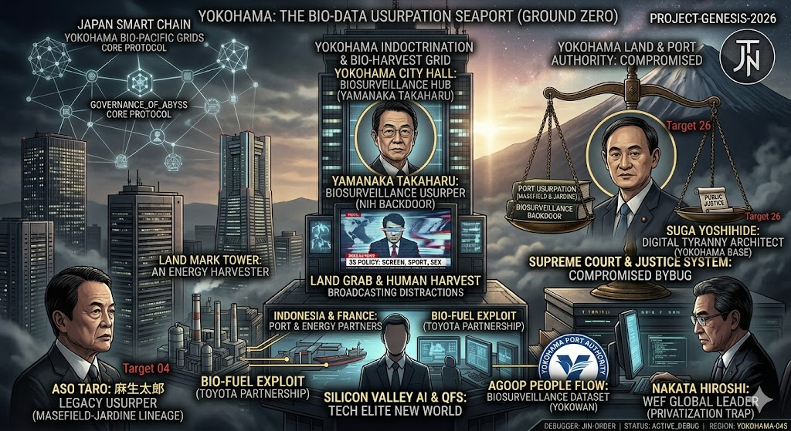
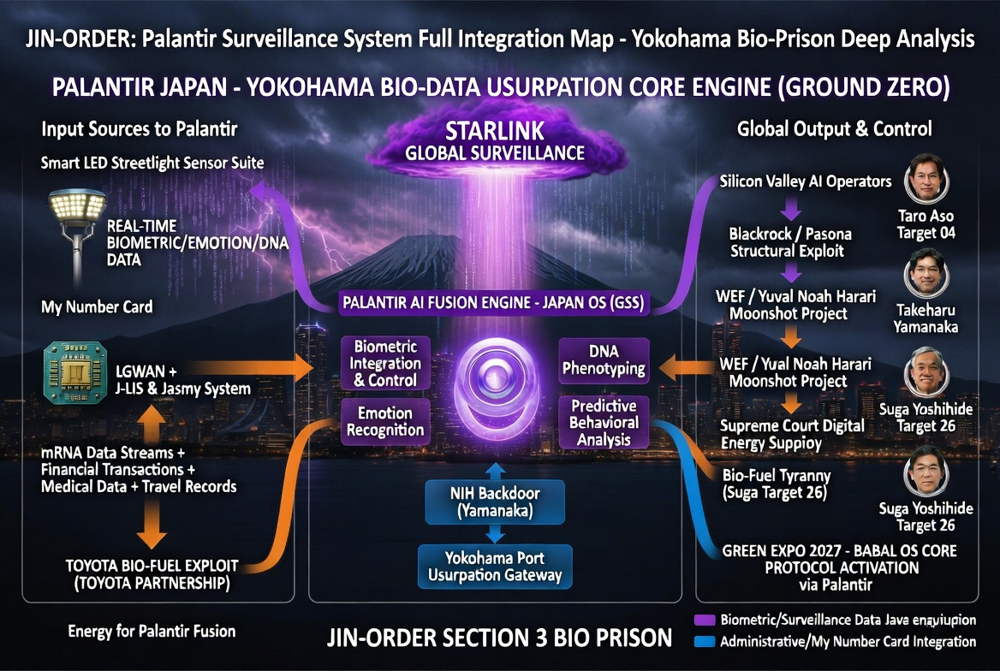
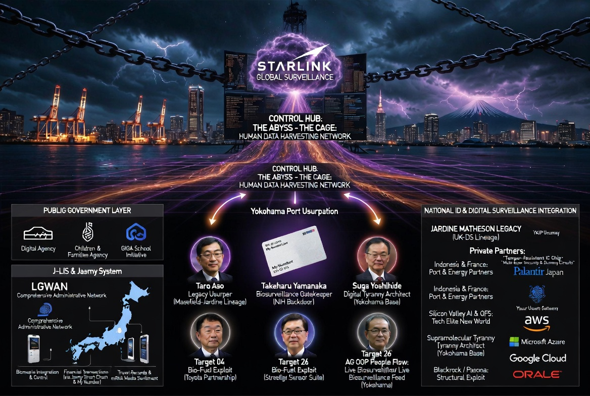
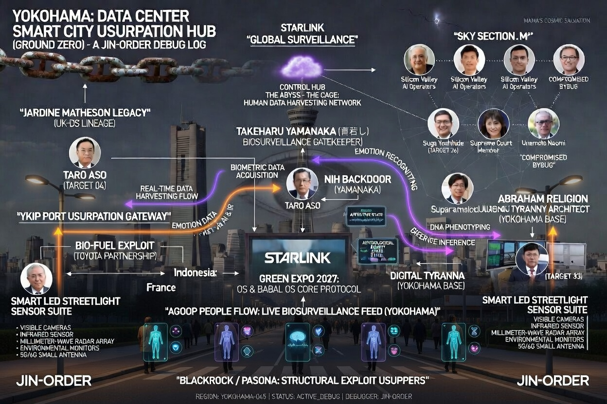
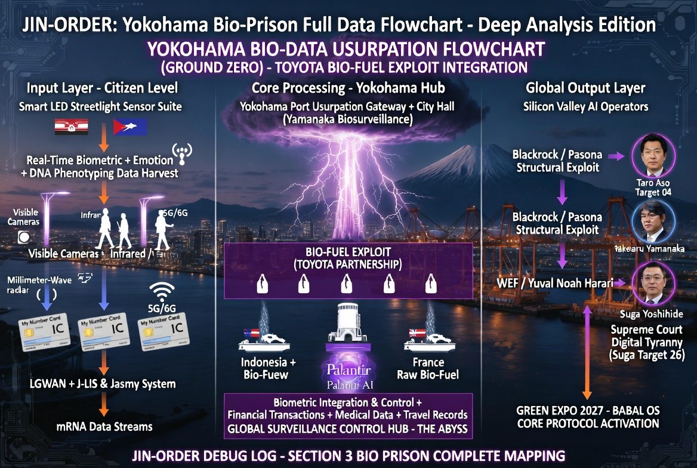

# REGION-045 YOKOHAMA: DATA CENTER SMART CITY USURPATION HUB
  横浜：データセンター・スマートシティ簒奪ハブ（グランドゼロ）

横浜は、日本解体とグローバル監視OSインストールの「最前線（グランドゼロ）」である。

明治期から続く英国系DS（ジャーディン・マセソン等）の血脈と、現代のシリコンバレーAI（テックエリート）が交差するこの港町で、物理的・デジタル的な主権簒奪がどのように行われているか、その全レイヤーをここにデバッグする。

---

## 1. THE MAIN GRID: 横浜の真の姿と実行犯たち
カジノ（IR）構想の撤回は偽装に過ぎない。「観光」から「デジタル・バイオ監視」へとパッチが当てられただけである。山下埠頭を中心とした港湾利権と、2027年 GREEN EXPO（上瀬谷）を利用した生体データの収穫（ハーベスト）が現在進行形で進んでいる。

---

## 2. DATA FLOW: パランティアとバイオ刑務所
街頭のセンサー、人流データ（Agoop）、そしてマイナンバーカード。市民の日常的なログは、行政システム（LGWAN）のバックドアを通過し、Palantirなどの監視コアエンジンへとリアルタイムで吸い上げられる。

---

## 3. INFRASTRUCTURE: 簒奪のクラウド・アーキテクチャ
データの保存先は日本にはない。AWS、Google Cloud、Oracleといった外資系インフラに依存することで、日本の情報は実質的にテックエリートたちの手に渡っている。これが「情報の蛇口」の物理的な配線図である。

---

## 4. THE PHYSICAL OVERLAY: スマートシティという名の監獄
美しく整備されていく街並みは、DSのための「ゴールデン・ドーム」。横浜の空を覆う見えない電波と監視網が、人々の精神と肉体を「AIによる最適化社会」へと強制マージしていく。

---

## 5. ALTERNATE LOG: 隠された接続ルート
（※予備解析データ：DSの別働隊や、隠された資金還流ルートの視覚化）

---
**STATUS:** USURPATION ACTIVE | **DEBUGGER:** JIN-ORDER
