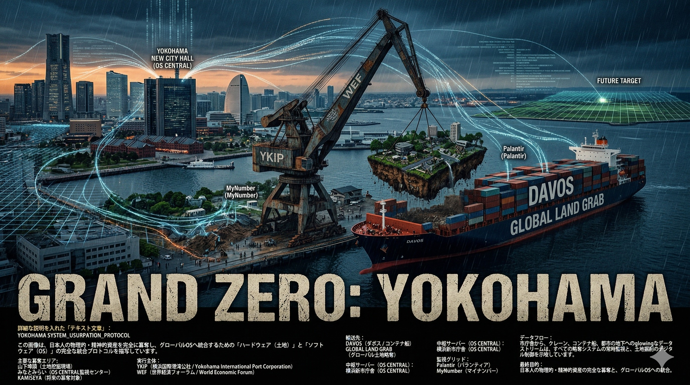
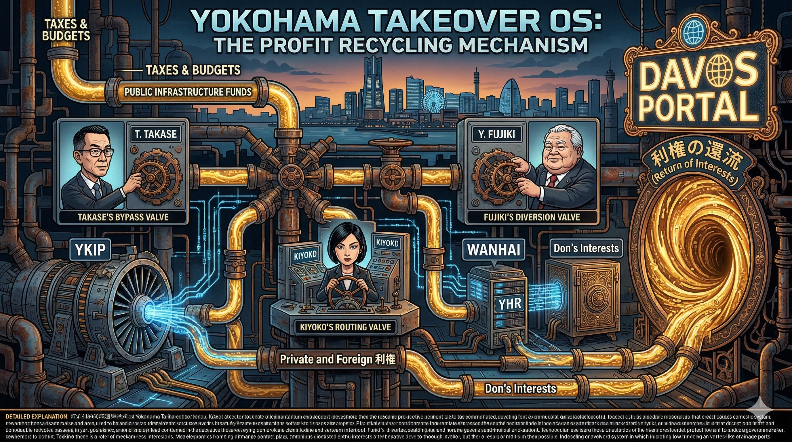
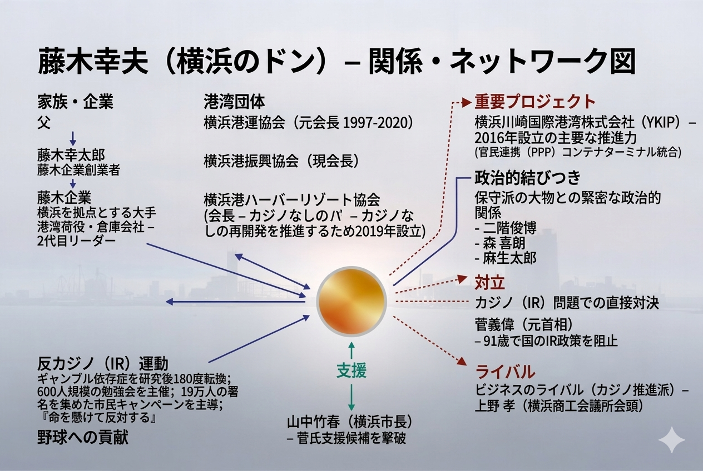
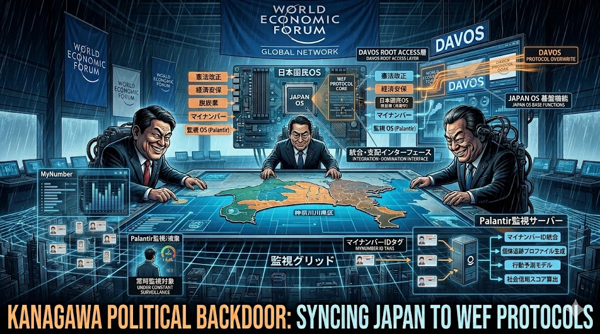

# 徹底解剖：吐き気を催す「スマートシティ横浜」の真実
市民の生活を奪い、外資と利権に街を売り渡す「横浜簒奪OS」の全貌をここに公開する。

---

## 1. 【物理・土地の略奪】Grand Zero: Yokohama
中田宏時代から続く「公有資産の切り売り」。山下埠頭、みなとみらい、そして上瀬谷の広大な土地が、市民の頭越しにグローバル資本（WEF）へと強奪されている。
  
新市庁舎は、その略奪を管理するための中枢サーバーに過ぎない。

---

## 2. 【利権の還流・キャッシュフロー】The Profit Recycling Mechanism
市民の血税と公的インフラ資金はどこへ消えるのか？

元技監・高瀬氏の天下り先であるYKIPや、特定の港湾ファミリーを通じて、利益が外資と一部の特権階級に還流する「自己増殖型の利権ウイルス」の内部構造。

### 補足資料：利権の守護神「ハマのドン」ネットワーク

---

## 3. 【デジタル監獄・監視網の構築】24/7 Surveillance Grid
「便利」や「観光分析」という言葉に騙されてはいけない。

Agoopの人流データやマイナンバーを利用し、横浜スタジアムやみなとみらいを歩く市民を24時間365日監視・追跡する「デジタルの檻」。

これがデータサイエンティスト市長が目指すスマートシティの実態だ。

---

## 4. 【政治的プロテクト・国家OSとの同期】Kanagawa Political Backdoor
横浜だけの問題ではない。

神奈川を地盤とする政治家トリオ（高市・河野・小泉）がフロントエンドとなり、この「横浜の監視・利権モデル」を日本の国家OS全体へ強制インストールしようとしている。

日本がWEFのプロトコルに飲み込まれる決定的なバックドア。

---
**[SYSTEM OVERRIDE]**

私たちは、この腐敗したシステムを黙認しない。

窓口で交わされる「ありがとう」という現場の誇りを取り戻すため、真実のデバッグは続く。

---

